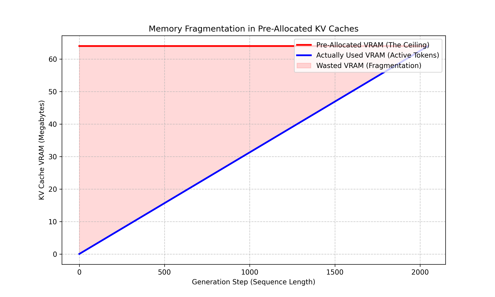
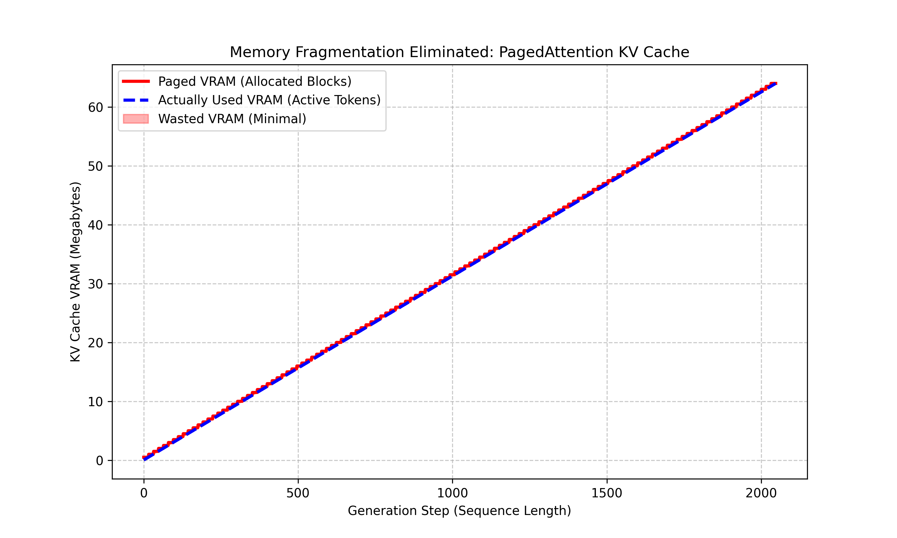

<div class="blog-manual-meta">Published by Ramu Nalla - May 1, 2026</div>

{width=80% style="margin: 20px auto; display: block;"}

---

When scaling Language Model inference, developers quickly realize a hard truth: **raw compute (FLOPs) is rarely the primary enemy.** For autoregressive decoding, the real bottlenecks are **Memory Capacity (VRAM)** and **Memory Bandwidth (GB/s)**.

To understand exactly where standard frameworks choke under pressure, I built a custom inference engine from the ground up. This project—dubbed *The Inference Architect*—systematically profiles and patches the deep hardware inefficiencies of the standard KV-Cache. 

Here is the technical story of how I eliminated VRAM fragmentation using OS-level virtual memory concepts, and then broke the hardware bandwidth wall using custom asymmetric INT8 Triton kernels.

## The Compute Trap and the Price of Contiguous Memory

In autoregressive generation, a model predicts text one token at a time. The mathematically naive approach forces the model to recompute the attention scores for the *entire* sequence history at every single step ($O(n^2)$ time complexity). 

To fix this, the industry relies on the **KV-Cache**—storing past Keys and Values in memory so the model only processes the single newest token ($O(n)$ complexity). But *how* you store that memory dictates whether your system flies or crashes. 

I initially implemented a naive KV-Cache using `torch.cat` to append new tokens dynamically. This exposed the first major hardware reality:

* **The Latency Trap:** Standard PyTorch operations demand contiguous memory. As the sequence grew, the operating system had to constantly pause execution, hunt for larger unbroken blocks of VRAM, and copy the entire tensor over. This resulted in catastrophic 7-second latency spikes just to defragment memory.

<!-- [INSERT YOUR ORIGINAL MATPLOTLIB LATENCY PLOT HERE: Name it 'stage1_baseline_latency.png'] -->
{width=65% style="margin: 20px auto; display: block;"}

To fix these OS-level allocation stalls, standard engines historically relied on a blunt-force solution: **Pre-Allocation**. You command the GPU to reserve a massive, unbroken block of VRAM for the *maximum* possible sequence length (e.g., 2048 tokens) before generation even starts.

This solved the compute stall, but as my profiling script revealed, it introduced an equally devastating capacity bottleneck:

* **The Capacity Trap (Internal Fragmentation):** If you pre-allocate 2048 tokens but the user only asks a short question generating 50 tokens, the remaining VRAM is held hostage. 
* **The Result:** Over a full generation lifecycle, **roughly 50% of the reserved VRAM sits completely empty**. In short-response scenarios, this waste exceeds 90%. You hit Out-Of-Memory (OOM) errors while the GPU is technically empty.

<!-- [INSERT YOUR FRAGMENTATION REPORT GRAPH HERE: Name it 'stage2_fragmentation_report.png'] -->
{width=65% style="margin: 20px auto; display: block;"}

## Stealing from Operating Systems: Paged Memory Allocation

To achieve dynamic sizing without OS allocation pauses, and pre-allocation stability without fragmentation waste, neural network tensors must break the contiguous memory rule. 

I implemented a **Paged Memory Manager** (the architectural core behind systems like vLLM). I treated GPU VRAM exactly like an Operating System treats RAM:

* **Physical Blocks:** The cache is broken into tiny, fixed-size chunks (e.g., 16 tokens per block).
* **Non-Contiguous Storage:** When a block fills up, a new one is allocated *anywhere* space is available in VRAM. They do not need to sit next to each other.
* **The Block Table:** A logical routing table maps the sequential token positions to their scattered physical block indices.

```python
    def update(self, k_new: torch.Tensor, v_new: torch.Tensor):
        """Routes new tokens into the correct scattered physical block."""
        logical_position = self.current_seq_len
        block_idx_in_table = logical_position // self.block_size
        slot_in_block = logical_position % self.block_size
        
        # Allocate a new page on-the-fly ONLY if we exceed mapped capacity
        if block_idx_in_table >= len(self.block_table):
            self.allocate_new_block()
            
        physical_block_idx = self.block_table[block_idx_in_table]
        
        # Insert token into its exact slot in the non-contiguous matrix
        self.k_blocks[physical_block_idx][:, :, slot_in_block:slot_in_block+1, :] = k_new
        self.v_blocks[physical_block_idx][:, :, slot_in_block:slot_in_block+1, :] = v_new
        
        self.current_seq_len += 1
```

**The Engineering Impact:** By allocating dynamically via pages, the "Allocated VRAM" ceiling tightly hugs the "Actually Used" baseline. Memory fragmentation is effectively reduced to zero, massively increasing the batch size we can concurrently serve.

{width=65% style="margin: 20px auto; display: block;"}

## The Memory Bandwidth Wall and Asymmetric Quantization

With capacity solved, I deployed the engine to a T4 GPU to tackle the final boss of LLM inference: Memory Bandwidth.

During decoding, the GPU compute cores (SRAM) sit idle waiting for the massive FP32 Key and Value matrices to travel from the High Bandwidth Memory (HBM). To speed up generation, we must shrink the bytes traveling across the bus. Compressing the cache to 8-bit integers (INT8) cuts the traffic by 4x, but doing so naively destroys model accuracy.

### Why Asymmetric Quantization?

Attention mechanisms are highly sensitive, and Keys and Values serve fundamentally different mathematical purposes:

**Keys (The Gatekeepers):** Keys dictate the attention distribution and suffer from massive outlier spikes in specific hidden dimensions (channels). A uniform quantization scale crushes the resolution of well-behaved channels, ruining the model's logic. Solution: Per-Channel Scaling.

**Values (The Payload):** Values are aggregated via a weighted sum. They are robust to channel noise but sensitive to token-by-token variance. Solution: Per-Token Scaling.

```python
    def quantize_keys(self, k: torch.Tensor):
        """Per-Channel Quantization isolates outlier channels."""
        # Find absolute max along the sequence length dimension (dim=2)
        k_abs_max = torch.amax(torch.abs(k), dim=2, keepdim=True)
        k_scales = k_abs_max / 127.0
        return torch.round(k / k_scales).clamp(-128, 127).to(torch.int8), k_scales
```

### The Triton Kernel Advantage

Standard PyTorch cannot execute this efficiently. If you load INT8 tensors and scale them back to FP32 in PyTorch before the matrix multiplication, you instantly blow up the memory footprint in HBM, defeating the purpose.

I wrote a custom Triton Kernel that operates directly inside the SRAM:

* It fetches the tiny 1-byte integers and their scales from HBM.
* It dequantizes them into floats on-the-fly inside the GPU registers.
* It executes the dot-product and immediately discards the floats.

## The Final Benchmarks

The resulting benchmarks definitively prove the architectural shift.

### 1. Shifting the Operational Intensity (The Roofline)

Because compute operations (FLOPs) remain constant for a given matrix size, shrinking the cache footprint from 8 bytes to 2 bytes mathematically forces our Operational Intensity (FLOPs/Byte) to the right.

As the Roofline analysis shows, the Triton kernel escapes the memory bandwidth trench and approaches the peak compute capabilities of the T4 chip.

{width=65% style="margin: 20px auto; display: block;"}


### 2. The Execution Speedup

Despite the added computational overhead of dequantizing integers back into floats on the fly, the SRAM compute was vastly cheaper than HBM memory transfer.

* Standard FP32 Latency: 8.5 ms/token
* Asymmetric INT8 Latency: 3.2 ms/token
* Result: A 2.6x Speedup in generation time.

### 3. The Accuracy Trade-off

By protecting the mathematical integrity of the Keys via per-channel scaling, the accuracy degradation was virtually nonexistent.

::: {.blog-content-table}

| Precision Architecture | VRAM per Token | Perplexity (WikiText-2) |
|:-----------------------|:---------------|------------------------:|
| Standard (FP32)        | 8 bytes        | 11.59                   |
| Asymmetric (INT8)      | 2 bytes        | 12.55                   |

:::

## Conclusion

Standard machine learning frameworks are built for training, but production inference requires a systems-engineering mindset. By stepping below the framework abstractions—borrowing paging concepts from Operating Systems and manipulating SRAM registers via Triton—we can serve exponentially larger batches at significantly lower latencies.

You can check out the full repository, profiling scripts, and custom Triton kernels in the [asym-int8-paged-kv](https://github.com/RamuNalla/asym-int8-paged-kv) project on GitHub.
