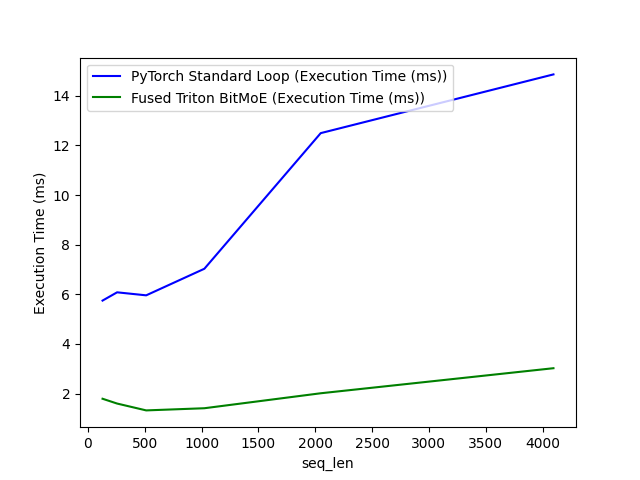

<div class="blog-manual-meta">Published by Ramu Nalla - April 23, 2026</div>

{width=60% fig-align="center"}

---

Mixture-of-Experts (MoE) is the undisputed industry standard for scaling Large Language Models. By sparsely activating specific neural pathways, you can drastically increase a model's parameter count without exploding the active compute (FLOPs).

However, when you try to deploy a standard MoE model in production, you immediately hit a wall: **massive VRAM fragmentation**. All expert weights must remain loaded in memory, and standard PyTorch implementations use horribly inefficient `gather`/`scatter` looping logic to route tokens. This completely shatters GPU memory bandwidth.

For my latest deep-dive, **BitMoE-158**, I decided to engineer a solution from first principles. By aggressively compressing the Expert layers to 1.58-bit ternary precision and bypassing standard PyTorch routing loops with a custom OpenAI Triton GPU kernel, I achieved a **75.51% reduction in peak VRAM** and a **5x throughput acceleration**.

Here is how I bridged algorithmic model compression and low-level C-style systems engineering to build it.

## The Architecture: Asymmetric MoE

If you quantize an entire MoE block, the model falls apart. The gating network (the Router) must calculate delicate top-k probabilities to effectively distribute token loads. If you crush the router to 1-bit, it loses its nuance and triggers "Router Collapse" (dumping all tokens into a single expert).

To fix this, I used an **Asymmetric Precision** design:

* **The Router:** Operates in high-fidelity `FP16` to maintain probabilistic accuracy.
* **The Experts (FFNs):** Compressed entirely to strictly $\{-1, 0, 1\}$ using a custom Straight-Through Estimator (STE) during training.

Since the Experts contain ~90% of an MoE's parameter count, targeting them wipes out the bulk of the memory footprint while keeping the model's reasoning intact.

```python
class SparseMoEBlock(nn.Module):
    """Asymmetric MoE: FP16 Router with 1.58-bit Ternary Experts."""
    def __init__(self, d_model: int, hidden_dim: int, num_experts: int, top_k: int):
        super().__init__()
        self.router = TopKRouter(d_model, num_experts, top_k) # FP16

        # Replacing standard linear layers with Ternary BitLinear layers
        self.experts = nn.ModuleList(
            [BitExpert(d_model, hidden_dim) for _ in range(num_experts)]
        )
```

## The Initialization Trap: Soft-Start Heuristic

Combining sparse routing with extreme 1-bit quantization creates a massive initialization hazard. If a naive router dumps a large batch of tokens into a newly initialized 1.58-bit expert, the resulting violent gradients will physically shatter the discrete weights, preventing the network from ever learning.

To act as a mathematical shock absorber, I implemented a Softmax Temperature Annealing heuristic.

By intercepting the raw logits and dividing them by a Temperature variable $ T $, we flatten the probability curve:

$$ P_i = \frac{e^{z_i / T}}{\sum e^{z_j / T}} $$

At Training Step 0, I set $ T = 5.0 $. This mathematically forced the router into a uniform distribution, dealing tokens out evenly to all experts. This "Soft-Start" allowed safe, even gradient flows across all experts. Over 250 steps, $ T $ cooled to $ 1.0 $, allowing the router to harden its decisions only after the ternary weights had stabilized.

## Killing the "For-Loop of Death" with Triton

The Achilles heel of standard PyTorch MoE is the dispatch loop. Standard implementations physically loop through experts (for i, expert in enumerate(experts):), masking out irrelevant tokens. This sequential iteration destroys hardware parallelism.

To bypass this, I dropped down to C-level GPU memory logic using OpenAI Triton.

I wrote a custom @triton.jit kernel that fuses the memory routing and the ternary matrix multiplication into a single, contiguous CUDA operation.

In-Place Permutation: Before launching the kernel, Python sorts the tokens by expert assignment, guaranteeing the GPU can execute fast, continuous memory reads.

The Int8 Memory Hack: The ternary weights ($\{-1, 0, 1\}$) are passed across the GPU bus stored as int8 to maximize memory bandwidth, and are instantly cast to float16 directly inside the SRAM compute cores to execute the math.

```python
@triton.jit
def _fused_158b_moe_kernel(X_ptr, W_ptr, Out_ptr, ...):
    # ... [Pointer setup and masking omitted for brevity] ...

    # Block-Tiled Matrix Multiplication Loop
    for k in range(0, tl.cdiv(K, BLOCK_SIZE_K)):
        # Load tokens in FP16
        x = tl.load(x_ptrs, mask=mask_m[:, None] & ...)

        # Load W (The 1.58b {-1, 0, 1} weights, stored as int8 to save bandwidth)
        w_int8 = tl.load(w_ptrs, mask=...)

        # Convert quantized weights to float16 directly on the SRAM for the math
        w_fp16 = w_int8.to(tl.float16)

        # Fused Accumulation
        accumulator += tl.dot(x, w_fp16)

    # Apply routing weights and write output via atomic_add
    accumulator = accumulator * router_weights[:, None]
    tl.atomic_add(out_ptrs, accumulator, mask=...)
```

## Benchmarking the Hardware Reality

To scientifically measure the success of this architecture, I ran a strict performance comparison on an NVIDIA Turing T4 GPU against a standard PyTorch baseline of the exact same dimensions.

The fair comparison path times **only the first expert projection (`w1`)** in both the PyTorch loop and the fused Triton path; you can regenerate the sweep with `python execution.py` from the repository.

::: {.blog-content-table}

| Sequence length | PyTorch (ms) | Fused Triton (ms) |
|:----------------|-------------:|------------------:|
| 128 | 5.75 | 1.79 |
| 256 | 6.08 | 1.60 |
| 512 | 5.96 | 1.32 |
| 1024 | 7.03 | 1.41 |
| 2048 | 12.49 | 2.01 |
| 4096 | 14.86 | 3.02 |

:::

{width=45% fig-align="center"}

💾 The VRAM Victory: The BitMoE architecture dropped peak memory allocation from 392.02 MB down to 96.02 MB—a 75.51% reduction.

⚡ The Throughput Victory: At a sequence length of 4096, standard PyTorch execution time ballooned to 14.86ms due to memory bottlenecking. The fused Triton kernel completed the same pass in 3.02ms.

By physically writing the kernel, we unblocked the theoretical speed limits of 1.58-bit logic, achieving a massive 5x speedup.

## Final Thoughts

BitMoE-158 proves that we don't have to accept the default, framework-level bottlenecks of MoE architectures. By stepping outside of high-level Python and engineering the memory layout directly, we can deploy highly complex, sparse neural networks directly onto edge-constrained hardware.

Check out the full repository, Triton code, and mathematical proofs on my [GitHub](https://github.com/RamuNalla/bitmoe-kernel).
