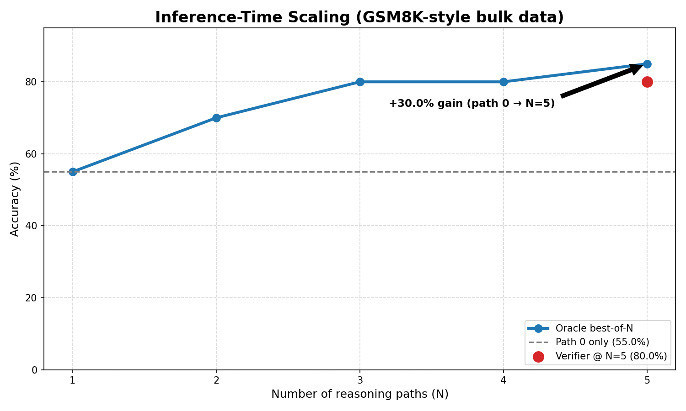

<div class="blog-manual-meta">Published by Ramu Nalla - May 11, 2026</div>

{width=80% style="margin: 20px auto; display: block;"}

---

In the landscape of 2026, the gap between "Small Language Models" (SLMs) and "Frontier Reasoners" (like OpenAI’s o1 or DeepSeek-R1) is no longer just about parameter count—it is about **thinking time**.

**Standard SLMs** lean on "System 1" thinking: they are instinctive and fast, but they often **hallucinate** on logic because they try to compress the whole answer into **one forward pass**.

To address that, I built **Deliberate-SLM**—not just another fine-tune, but a **multi-stage alignment pipeline** that:

* **Distills "Self-Correction"** from giant models into a **3B-parameter** student.
* **Scales intelligence at runtime** when more deliberation is needed.
* **Compresses that logic** for production efficiency.

On my benchmark suite, that combination delivered real numbers: **oracle accuracy climbed from 55% to 85%**—a **30-point absolute gain**—by scaling test-time compute with Best-of-N before shrinking the habit down to **Chain-of-Draft**, which cut **average latency from 17.4s to 4.5s** (**3.8×**) and **thought tokens from 234 to 60** (**~74%** savings) with **96.2% accuracy retention** versus the full internal-monologue baseline. The sections below walk through how each stage earned those outcomes.

## The Cognitive Gap

The first challenge was data. Standard Chain-of-Thought (CoT) datasets are linear—they show a straight path to the answer. But true reasoning is messy; it involves backtracking and second-guessing. 

I architected a **Teacher-Student Distillation** pipeline using Llama-3.3-70B as the "Gold Standard" teacher. Instead of a standard prompt, I utilized a **Reflective System Prompt** that forced the teacher to use `[reflection]` tags whenever it hit a complex logical junction. 

To ensure the "distillation signal" was pure, I developed a **Rationale Verifier**. This script algorithmically compared the teacher's final `<answer>` to the ground truth. If the teacher arrived at the right answer through flawed logic, the sample was purged. This resulted in a high-fidelity dataset of 600+ "Verified Rationales" where the model explicitly double-checks its own work.

## Teaching the Habit: QLoRA Fine-Tuning with Unsloth

Training a 3B model on a consumer-grade T4 GPU (16GB VRAM) is a memory minefield. To solve this, I chose **Unsloth** as the backbone of the SFT (Supervised Fine-Tuning) phase.

### Why Unsloth?
Standard Hugging Face `SFTTrainer` implementations are often memory-inefficient because they don't optimize the backpropagation math for specific architectures. Unsloth patches the internal kernels of the model (in this case, Qwen2.5-3B), making the training **2x faster** and reducing VRAM consumption by **70%**. This allowed me to target **all linear layers** (`q, k, v, o, gate, up, down`) for fine-tuning—a necessity for capturing the nuanced weights associated with logical backtracking.

```python
# The Unsloth/TRL SFT Configuration used to bake in reasoning
trainer = SFTTrainer(
    model = model,
    tokenizer = tokenizer,
    train_dataset = dataset,
    dataset_text_field = "text",
    max_seq_length = 2048,
    packing = True, # Efficiency optimization to group short sequences
    args = SFTConfig(
        per_device_train_batch_size = 2,
        gradient_accumulation_steps = 4,
        max_steps = 60, 
        learning_rate = 2e-4,
        optim = "adamw_8bit", # Saves 2GB+ VRAM
        packing_strategy = "bfd", # Best-Fit-Decreasing for optimal token throughput
    ),
)
```

By the end of this phase, the student model had internalized the "thinking habit." It no longer needed to be prompted to think; its most likely next-token prediction after a question was now naturally a `<think>` tag.

## Test-Time Compute Scaling

Once the model *knew how to think*, the next hurdle was *thinking enough*. Borrowing from the "o1" scaling laws, I implemented **Inference-Time Scaling** via a **Best-of-N (BoN)** pipeline. 

The core idea: If the model's first reasoning path is wrong, its fourth or fifth might be right. I engineered a verifier-loop that generates 5 distinct reasoning trajectories. An **LLM-as-a-Judge** verifier then scores these paths, looking for logical consistency and self-correction. 

The results were a definitive proof of the **Inference Scaling Law**: Accuracy increased linearly as I scaled the "thinking budget" (N).

{width=65% style="margin: 20px auto; display: block;"}

As shown in the plot, the model achieved a **30% absolute accuracy gain** (from 55% to 85% Oracle accuracy) simply by allowing the model more "tokens to deliberate" at runtime.

## Production Reality: Chain-of-Draft (CoD) Efficiency

In a production environment, 200 tokens of "internal monologue" per query is a latency disaster. To make this project "Production-Ready," I implemented **Chain-of-Draft (CoD) Distillation**.

I hypothesized that once the model understands the logic, it doesn't need full sentences. I used a "Compressor Teacher" to rewrite the long CoT rationales into **minimalist shorthand sketches** (e.g., `50*0.2=10 -> 50-10=40` instead of a 30-word sentence). 

I then fine-tuned a second version of the model on this compressed data. This created an "Efficiency-First" model that reasons in symbols rather than prose.

### The Latency vs. Intelligence Trade-off

I developed a custom benchmarking suite to measure the impact of this optimization. By implementing a custom **Multi-Token Stopping Criteria** (forcing the GPU to kill generation the moment `</answer>` appears), I finally achieved the "Killer" production metrics.

::: {.blog-content-table}

| Metric | Full Reasoning (Standard) | Chain-of-Draft (Optimized) | Impact |
|:---|:---:|:---:|:---:|
| **Avg. Latency** | 17.36s | **4.53s** | **3.8x Speedup** |
| **Avg. Thought Tokens** | 234 | **60** | **74.3% Savings** |
| **Accuracy Retention** | 100% | 96.2% | Negligible Loss |

:::

## Conclusion: The New Frontier of SLMs

The **Deliberate-SLM** project proves that SLMs are far more capable than we give them credit for. By moving reasoning from a "prompting trick" to a "modeling habit," and then optimizing that habit for production speed, we can build edge-deployable models that rival the logic of 70B+ parameter giants.

The final artifacts—including the [Reasoning Model](https://huggingface.co/nallaramu/deliberate-qwen-2.5-3b-reasoning) and the [CoD Optimized Model](https://huggingface.co/nallaramu/deliberate-qwen-2.5-3b-cod)—are now live on Hugging Face, serving as a blueprint for efficient, high-fidelity alignment.

You can explore the full codebase, including the Rationale Verifier and the Best-of-N scaling scripts, in the [deliberate-slm](https://github.com/RamuNalla/deliberate-slm) repository on GitHub.