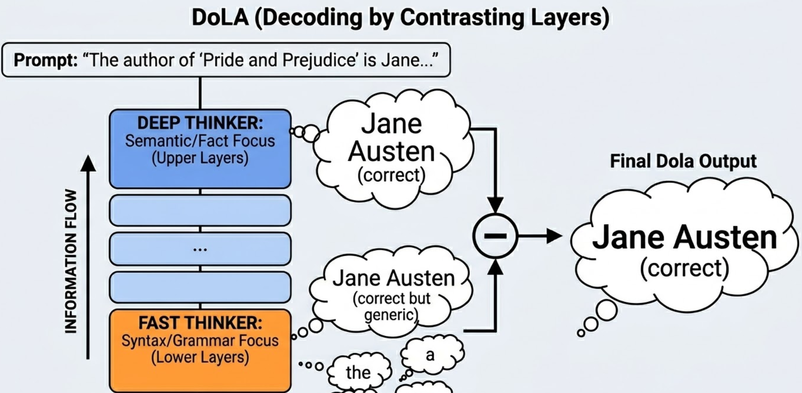

<div class="blog-manual-meta">Published by Ramu Nalla - Feb 13, 2026</div>

{width=60%}

---

If you have ever built a production application using Large Language Models (LLMs), you have likely hit a wall called **Hallucination**.

You see the model confidently declare that Jane Austen wrote *Frankenstein*, or output a Python library that doesn't exist. Standard decoding strategies like Top-K or Nucleus (Top-p) Sampling don't fix this. They just truncate the tail of the probability distribution, but "plausible-sounding lies" often hide right at the top of that distribution. 

At its core, a hallucination is a failure of **Knowledge Retrieval**. The model defaults to generating words that statistically "look right" instead of words that are factually correct.

In this post, I am going to bypass the academic jargon of the 2023 paper *DoLa: Decoding by Contrasting Layers*. I will take a custom PyTorch implementation of this advanced decoding strategy, break it down line-by-line, and crucially, I will trace the math with real numbers so you can see exactly how we can mathematically force an LLM to tell the truth.

## The Code: Contrastive Layer Decoding (DoLa)

Let's start with the raw code. This is how you intercept an LLM's forward pass to manipulate its raw thinking process before it generates a token.

```python
import torch
import torch.nn.functional as F

def get_dola_logits(model, input_ids, mature_layer=11, premature_layer=5, alpha=1.0):
    """
    Args:
        model: Pre-trained LLM (e.g., GPT-2 with 12 layers)
        input_ids: Tokenized input sequence
        mature_layer: Index of the deep, factual layer
        premature_layer: Index of the shallow, syntactic layer
        alpha: Penalty strength for the premature layer
    """
    # 1. Forward pass requesting ALL hidden states
    with torch.no_grad():
        outputs = model(input_ids, output_hidden_states=True)
    
    # 2. Extract hidden state for the LAST token
    mature_hidden = outputs.hidden_states[mature_layer][0, -1, :]
    premature_hidden = outputs.hidden_states[premature_layer][0, -1, :]
    
    # 3. Project hidden states to Vocabulary Logits
    mature_logits = model.lm_head(mature_hidden)
    premature_logits = model.lm_head(premature_hidden)
    
    # 4. Compute mature probabilities for masking
    mature_probs = F.softmax(mature_logits, dim=-1)
    
    # 5. Dynamic thresholding (Keep only plausible tokens)
    top_k_probs, _ = torch.topk(mature_probs, 50)
    threshold = top_k_probs[-1] 
    
    # 6. Contrastive Subtraction
    contrastive_logits = mature_logits - (alpha * premature_logits)
    
    # 7. Apply mask (set garbage tokens to negative infinity)
    mask = mature_probs < threshold
    contrastive_logits[mask] = -float('inf')
    
    # 8. Convert to final probabilities
    dola_probs = F.softmax(contrastive_logits, dim=-1)
    
    return dola_probs

```

If that looks intimidating, don't worry. We need to fix how we visualize the Transformer's reasoning process first.

## Fast Thinkers vs. Deep Thinkers

The biggest source of confusion in LLM inference is treating the model as a black box that just spits out a final answer. You must start thinking of the Transformer layers as a **Hierarchy of Reasoning**.

* **Lower Layers (The Fast Thinker):** Early layers (e.g., Layer 5) focus on grammar, syntax, and basic statistical likelihood. They know that after the word "Neil," a last name usually follows. They don't know history.
* **Higher Layers (The Deep Thinker):** Later layers (e.g., Layer 11) consolidate global context and extract factual knowledge. This is where the model realizes the specific entity is "Armstrong."

Hallucinations happen when the "Fast Thinker" overpowers the "Deep Thinker." If the model is slightly unsure of a fact, it relies on the highly probable, generic grammatical structure. 

DoLa fixes this by calculating the predictions at a mature layer, calculating them at a premature layer, and **subtracting the difference**.

## An Example

Let's trace the code with a tiny example. 

* **Sequence:** "The first man to walk on the moon was Neil"
* **Vocabulary:** `["Armstrong", "Smith", "and"]`
* **Alpha ($\alpha$):** 1.0

### Step 1: The Inputs (Mature vs. Premature Logits)

Imagine our model projects the hidden states into the following raw scores (logits).

**Mature Layer Logits ($z_{\text{mature}}$):** (Knows some facts, knows grammar)

* "Armstrong": 8.0
* "Smith": 6.0
* "and": 4.0

**Premature Layer Logits ($z_{\text{premature}}$):** (Only knows grammar and common names)

* "Armstrong": 1.0 (Doesn't know space history)
* "Smith": 5.5 ("Smith" is a very common last name)
* "and": 4.0 (A common connective word)

### Step 2: The Contrastive Subtraction

This corresponds to this line of code:

```python
contrastive_logits = mature_logits - (alpha * premature_logits)

```

We want to isolate the **Pure Knowledge Signal** by stripping away the statistical noise.

$$S(y_t) = z_{\text{mature}} - \alpha \cdot z_{\text{premature}}$$

Let's run the math for each candidate token:

* **The Fact ("Armstrong"):** $8.0 - 1.0 = \mathbf{7.0}$
* **The Hallucination ("Smith"):** $6.0 - 5.5 = \mathbf{0.5}$
* **The Grammar ("and"):** $4.0 - 4.0 = \mathbf{0.0}$


### Why Not Just Use Top-K or Top-P?

You might be wondering: *Doesn't standard Nucleus (Top-p) sampling solve this?*

The short answer is no. Top-K and Top-P algorithms work by looking at the Mature Layer and simply chopping off the bottom of the probability distribution. They prevent the model from picking a completely random word from the "long tail."

**The flaw:** "Plausible-sounding lies" don't live in the tail. They live right at the top of the distribution.

In our example, if the model is slightly unsure about "Armstrong", the raw probability for "Smith" (a highly common name) might actually be higher due to background statistical bias. If you use Top-K, "Smith" is still sitting right there in the top candidates. If you just take the highest probability blindly, the model hallucinates "Neil Smith".

By looking for the **maximum of the contrastive score**, you are asking the neural network a fundamentally different question. You are no longer asking, *"What is the statistically most likely next word?"* You are asking, *"Which word experienced the biggest 'jump' in confidence between your shallow syntax layers and your deep knowledge layers?"*

Maximizing that difference mathematically isolates the "aha!" moment of the neural network, bypassing the statistical noise that causes confident hallucinations.

### What does this tell us?

Before DoLa, the model might have been tempted to output "Smith" because it had a high raw score (6.0) just based on it being a statistically common name. 

After subtraction, "Armstrong" experiences a massive mathematical spike. Why? Because it is the only word that the neural network suddenly became confident in *after* consulting its deep knowledge layers. We have successfully penalized the hallucination.


### Step 3: Handling the Mask

One line we glossed over:

```python
mask = mature_probs < threshold
contrastive_logits[mask] = -float('inf')

```

Why do we do this? Imagine a complete nonsense word like "banana". 


* Mature layer score: -10.0
* Premature layer score: -15.0
* Contrastive score: $-10.0 - (-15.0) = \mathbf{+5.0}$

Because the premature layer hated "banana" even more than the mature layer did, the subtraction accidentally gives it a massive positive boost! 

We prevent this by applying a dynamic threshold mask. We look at the mature layer's probabilities and say: *"If the mature layer didn't rank this token in the Top 50, throw it out immediately."* We set its score to `-inf`, ensuring it gets 0% probability in the final softmax.

## Summary

When you look at the `get_dola_logits` function now, try to see the story it tells:

1.  **Extract:** Grab the neural network's internal thoughts at both a shallow and deep stage.
2.  **Project:** Convert those thoughts into vocabulary scores.
3.  **Subtract:** Penalize tokens that are just "statistically common" (high in early layers) to amplify tokens that are "factually correct" (high in late layers).
4.  **Mask:** Hide the absolute garbage tokens so they don't accidentally get mathematically boosted.
5.  **Softmax:** Convert the new, factually-amplified scores into final probabilities.

By manipulating the logit landscape directly, we move beyond simply hoping the model guesses correctly. We actively engineer truth into the inference process.