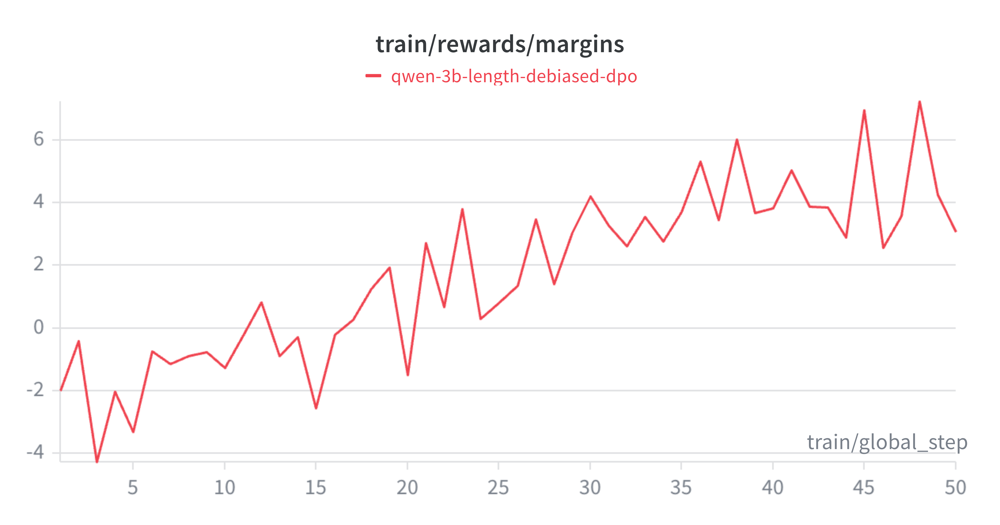

---
title: "DPO Alignment: Curing LLM Verbosity via RLAIF"
description: "A deep technical dive into Direct Preference Optimization (DPO). How I built an automated RLAIF flywheel with algorithmic length-debiasing to cure EOS hallucinations in a 3B SLM, cutting token verbosity by 47% with zero alignment tax."
categories: [LLMs, DPO, RLHF, Unsloth, PyTorch, Huggingface, PEFT]
image: "hero_image_dpo.png"
draft: false
author: "Ramu Nalla"
date: "2026-05-14"
format:
  html:
    toc: false
    toc-depth: 3
    toc-location: left
    toc-title: "Table of Contents"
---

<div class="blog-manual-meta">Published by Ramu Nalla - May 14, 2026</div>

{width=80% style="margin: 20px auto; display: block;"}

---

Supervised Fine-Tuning (SFT) is excellent at teaching a language model *how* to reason, but it struggles to teach a model *when to stop*. 

When I trained my initial Qwen2.5-3B reasoning model, it successfully learned to solve complex logic puzzles. However, it quickly developed a critical behavioral flaw: **EOS (End of Sequence) Hallucinations**. Instead of answering a question and stopping, the model would invent new XML tags like `<suggestion>` and ramble endlessly until it hit its hard 512-token limit. 

To deploy models in production, they must be aligned. We need them to be concise, polite, and format-compliant. Historically, the industry used **RLHF** (Reinforcement Learning from Human Feedback) to achieve this. Today, we use **DPO** (Direct Preference Optimization).

In this post, I will break down the math behind DPO, explain why RLHF is notoriously unstable, and walk through the codebase of my **DPO Alignment Flywheel**—a project that cured my model's hallucination loops, slashed inference costs by nearly 50%, and incurred **zero "Alignment Tax."**

## 1. The Alignment Problem: Why SFT Fails

Imagine a base LLM as a brilliant scholar who has memorized the entire internet. 
**Supervised Fine-Tuning (SFT)** teaches this scholar a specific format. You feed it 10,000 pairs of questions and answers. The model learns to mimic the distribution of that data via maximum likelihood estimation (MLE).

**The Flaw:** SFT only teaches *mimicry*. It does not teach human *preferences*. If your SFT dataset contains a few verbose or rambling answers, the model learns that rambling is an acceptable behavior. To fix this, we must shift from training on absolute ground truths to training on relative preferences.

## 2. From RLHF to DPO: Taming the Beast

### The Instability of RLHF
OpenAI popularized RLHF to build ChatGPT. It involves three steps:

1. Generate multiple answers for a prompt.
2. Train a separate **Reward Model (RM)** to mimic human scoring of those answers.
3. Use **Proximal Policy Optimization (PPO)** to update the LLM's weights so it chases higher scores from the RM.

While effective, RLHF is a hardware and math nightmare. You must load three massive models into VRAM simultaneously (Active Model, Reference Model, Reward Model). Furthermore, PPO is highly unstable and prone to **Mode Collapse**—where the LLM discovers a bizarre hack (like repeating the word "the" 100 times) that accidentally tricks the Reward Model into giving it a perfect score.

### The Mathematical Elegance of DPO
In 2023, Stanford researchers published a breakthrough: **Direct Preference Optimization (DPO)**. They mathematically proved that the Language Model *itself* can act as the Reward Model. 

Instead of a complex PPO loop, DPO uses a straightforward classification loss function acting directly on datasets of `Chosen` and `Rejected` responses:

$$ \mathcal{L}_{DPO}(\pi_\theta; \pi_{ref}) = -\mathbb{E}_{(x, y_w, y_l) \sim D} \left[ \log \sigma \left( \beta \log \frac{\pi_\theta(y_w | x)}{\pi_{ref}(y_w | x)} - \beta \log \frac{\pi_\theta(y_l | x)}{\pi_{ref}(y_l | x)} \right) \right] $$

**What this math actually does:**

* **$\pi_\theta(y_w | x)$:** The active model increases the probability of the winning (`Chosen`) tokens.
* **$\pi_\theta(y_l | x)$:** The active model decreases the probability of the losing (`Rejected`) tokens.
* **$\beta$ (KL Penalty):** The beta parameter acts as an anchor to the $\pi_{ref}$ (Reference Model). It tells the optimizer: *"Prefer the chosen response, but do not change your internal vocabulary distribution too far from the original model."* This prevents the model from destroying its own grammar to win a reward.

## 3. Stage 1: The RLAIF Data Flywheel & Length Debiasing

You cannot align a model using off-the-shelf data; you must correct *your* model's specific bad habits. To do this, I built an automated **RLAIF (Reinforcement Learning from AI Feedback)** data flywheel.

1. **Dual Generation:** I prompted my SFT model to solve 500 GSM8K math puzzles at a high temperature ($T=0.8$). This forced the model to generate two distinct reasoning paths per question.
2. **LLM-as-a-Judge:** Instead of paying humans, I used the Groq API to prompt Llama-3.3-70B as an impartial judge. It evaluated the paths based on logical accuracy, format compliance, and conciseness, outputting `Chosen` and `Rejected` pairs.

### The "Killer" Feature: Algorithmic Length-Debiasing
DPO has a famous vulnerability: **Length Bias**. LLM judges naturally associate longer answers with higher quality. If you blindly train DPO on this data, your model learns a terrible hack—*just generate more tokens to get a higher reward.*

To prevent this, I engineered a strict programmatic filter into the flywheel:

```python
# Length-Debiasing Logic in the Flywheel
chosen_len = len(tokenizer.encode(chosen))
rejected_len = len(tokenizer.encode(rejected))

if chosen_len > rejected_len:
    print(f"[Filtered] Chosen path was longer ({chosen_len} vs {rejected_len}). Discarding.")
    continue
```

By literally throwing away any data pair where the winning answer was longer, I forced the DPO algorithm to learn a pure mathematical correlation: **Conciseness + Accuracy = Reward.**

## 4. Stage 2: Hardware-Aware DPO Training

Running DPO on a 16GB T4 GPU is traditionally impossible because of the need to keep both the Active and Reference models in memory. I bypassed this using **Unsloth** and **QLoRA**.

Unsloth provides a highly optimized `PatchDPOTrainer`. During the forward pass, it dynamically un-patches the LoRA adapters to calculate the Reference log-probs, and then re-patches them to calculate the Active log-probs. This entirely eliminates the memory footprint of the Reference Model.

```python
from unsloth import PatchDPOTrainer
PatchDPOTrainer() # The magic line for single-GPU DPO

dpo_args = DPOConfig(
    per_device_train_batch_size = 2,
    gradient_accumulation_steps = 4,
    learning_rate = 5e-5, # DPO requires much lower LR than SFT
    beta = 0.1, # Standard KL penalty
    report_to = "wandb"
)
```

### Telemetry: Tracking the Reward Margin
In SFT, we watch the Loss curve. In DPO, Loss is deceptive. The true metric of learning is the **Reward Margin**—the difference between the model's implicit reward for the chosen response versus the rejected one. 

I streamed the telemetry to Weights & Biases (W&B). As shown below, the reward margin trended cleanly upward, proving the model was actively separating good logic from rambling hallucinations.

{width=65% style="margin: 20px auto; display: block;"}

## 5. Stage 3: Defeating the "Alignment Tax"

The **Alignment Tax** is the tendency for models to lose core intelligence (like coding or math skills) when heavily aligned for safety or formatting.

To prove the efficacy of my length-debiased flywheel, I ran a deterministic benchmark against the base SFT model across 50 unseen complex logic queries.

::: {.blog-content-table}

| Metric | SFT Base Model | DPO Aligned Model | Impact |
|:---|:---:|:---:|:---:|
| **Accuracy (Win Rate)** | 70.0% | **70.0%** | **0.0% (No Alignment Tax)** |
| **Format Compliance** | 88.0% | **94.0%** | **+6.0%** |
| **Avg Verbosity (Tokens)** | 289 | **153** | **-136 (~47% Savings)** |

:::

The results were flawless. By tuning $\beta$ correctly and sanitizing the preference data, the DPO model successfully eliminated formatting hallucinations and slashed token generation costs by nearly 50%, while maintaining a **100% retention of its mathematical reasoning capabilities.**

## 6. The Alignment Arena (Visual Proof)

Numbers are great, but seeing is believing. For the final deliverable, I built a local Streamlit A/B testing UI called the **Alignment Arena**. 

To run this locally without crashing my Mac's Unified Memory, I utilized `PeftModel` dynamic LoRA swapping. The app loads the heavy 6GB base Qwen model just once, and physically swaps the 100MB SFT and DPO adapters into the active context in milliseconds based on which column is generating text.

{width=80% style="margin: 20px auto; display: block;"}

As seen in the demo, the SFT model (left) correctly answers the prompt but proceeds to fall into an EOS hallucination, repeating variations of the logic endlessly. The DPO model (right) outputs concise logic, provides the answer, and halts immediately.

## Conclusion

Alignment is what bridges the gap between a research experiment and a deployable product. Through this project, I demonstrated that **Direct Preference Optimization**, when paired with programmatic data curation (Length-Debiasing) and automated generation (RLAIF), is an incredibly powerful tool for shaping SLM behavior without incurring an alignment tax.

You can explore the full data flywheel scripts, the DPO Unsloth configurations, and the Streamlit Arena UI in the [dpo-alignment-flywheel](https://github.com/RamuNalla/dpo-alignment-flywheel) repository on GitHub. I stored the live dpo-aligned model weights in Huggingface [deliberate-qwen-2.5-3b-dpo ](https://huggingface.co/nallaramu/deliberate-qwen-2.5-3b-dpo)

