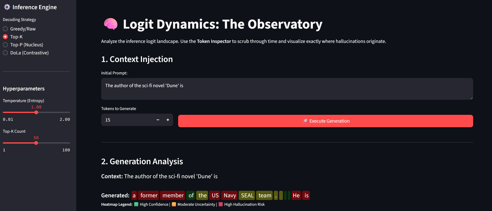

<div class="blog-manual-meta">Published by Ramu Nalla - February 20, 2026</div>

{width=60% fig-align="center"}

---

In my previous project, I focused on model *adaptation*—building LoRA from scratch to teach a model Elizabethan English. But as anyone building RAG systems knows, adapting a model is only half the battle. The other half is **control**. 

Standard generation APIs treat LLMs as black boxes. You throw a prompt in, maybe tweak the temperature, and hope the model doesn't confidently lie to your users. When hallucinations occur, the industry default is to blame the prompt or the training data.

For my latest project, **Logit-Dynamics**, I decided to look under the hood. I bypassed Hugging Face's standard `model.generate()` API to build a custom PyTorch inference engine. 

**The goal?** Expose the raw probability distributions, quantify the model's uncertainty in real-time using Shannon Entropy, and actively suppress hallucinations using a 2023 technique called **DoLa (Decoding by Contrasting Layers)**.

## The Architecture: Intercepting the Forward Pass

To control an LLM, you have to understand that it doesn't just output a single word; it outputs a massive vector of raw scores (logits) across its entire vocabulary. 

Standard decoding strategies like **Top-K** or **Nucleus (Top-p) Sampling** operate on these final scores by simply chopping off the bottom of the probability distribution. 

### The Flaw in Standard Sampling
Top-K and Top-P prevent the model from picking completely random words from the "long tail." But here is the critical flaw: **"plausible-sounding lies" don't live in the tail.** They live right at the top of the distribution.

If a model is slightly unsure about a fact, the statistical bias of common words (like generic names or filler syntax) will artificially inflate their scores. If you blindly apply Top-K, you are essentially guaranteeing a confident hallucination.

To fix this, we need to look deeper into the Transformer's reasoning hierarchy.

## DoLa: Fast Thinkers vs. Deep Thinkers

Language models process information in stages:

* **Lower Layers (The Fast Thinker):** Early layers focus on grammar, syntax, and statistical likelihood. 
* **Higher Layers (The Deep Thinker):** Later layers consolidate global context and retrieve factual knowledge.

**DoLa** fixes hallucinations by actively penalizing the "Fast Thinker." It calculates the predictions at a mature layer, calculates them at a premature layer, and subtracts the difference.

### The Contrastive Math
By contrasting the logits, we isolate the pure knowledge signal from the statistical noise:

$$S(y_t) = z_{\text{mature}} - \alpha \cdot z_{\text{premature}}$$

If a token has a high probability in the mature layer but a low probability in the premature layer, its score goes **up** (factual realization). If a token has a high probability in both layers, its score goes **down** (generic syntax).

### The Implementation
Here is how I implemented the DoLa intervention in PyTorch:

```python
def get_dola_logits(self, input_text, mature_layer=None, premature_layer=None, alpha=1.0):
    inputs = self.tokenizer(input_text, return_tensors="pt").to(self.device)
    
    # Forward pass requesting ALL hidden states
    with torch.no_grad():
        outputs = self.model(**inputs, output_hidden_states=True)
        
    # Extract the hidden state for the LAST token
    mature_hidden = outputs.hidden_states[mature_layer][0, -1, :]
    premature_hidden = outputs.hidden_states[premature_layer][0, -1, :]
    
    # Project hidden states to Vocabulary Logits
    mature_logits = self.model.lm_head(mature_hidden)
    premature_logits = self.model.lm_head(premature_hidden)
    
    mature_probs = F.softmax(mature_logits, dim=-1)
    
    # Dynamic threshold: Only consider plausible tokens
    top_k_probs, _ = torch.topk(mature_probs, 50)
    threshold = top_k_probs[-1] 
    
    # Contrastive Subtraction
    contrastive_logits = mature_logits - (alpha * premature_logits)
    
    # Mask out the noise 
    mask = mature_probs < threshold
    contrastive_logits[mask] = -float('inf')
    
    dola_probs = F.softmax(contrastive_logits, dim=-1)
    return dola_probs
```

## The Hallucination Monitor: Shannon Entropy

Fixing the logits is powerful, but in an MLOps context, telemetry is just as important. How do we know *when* the model is struggling?

When an LLM is reciting a known fact, its probability distribution is sharp. When it is guessing, the distribution flattens out. I quantified this uncertainty at every single generation step using **Shannon Entropy**.

$$H(X) = - \sum_{i=1}^{n} P(x_i) \ln P(x_i)$$

```python
def calculate_shannon_entropy(probs, epsilon=1e-9):
    """
    High Entropy = Flat Distribution = High Hallucination Risk.
    Low Entropy = Sharp Distribution = High Confidence.
    """
    entropy = -torch.sum(probs * torch.log(probs + epsilon))
    return entropy.item()
```

By tracking this metric over time, we can create a literal lie detector for the model. 

## The Logit-Dynamics Observatory

To bring this all together, I built a custom Streamlit dashboard that visualizes this data in real-time. 

{width=80% fig-align="center"}
{width=80% fig-align="center"}

### The Heatmap
The app dynamically injects HTML to color-code the generated text. Green indicates low entropy (confidence). When the model starts guessing—often right before generating a fake entity or hallucinated API call—the text bleeds red.

### The Token Inspector
The dashboard allows you to scrub through the generated sequence. You can select any individual token and view the exact Top-15 probability landscape at that precise microsecond, watching how DoLa re-ranked the options to save the model from a hallucination loop.

## Final Thoughts

By breaking open the inference loop, writing the sampling math from first principles, and applying contrastive layer decoding, we can engineer truth directly into the generation process. 

Check out the full repository and mathematical breakdowns on my [GitHub](https://https://github.com/RamuNalla/Logit-Dynamics-Advanced-Decoding-Entropy-Controls).