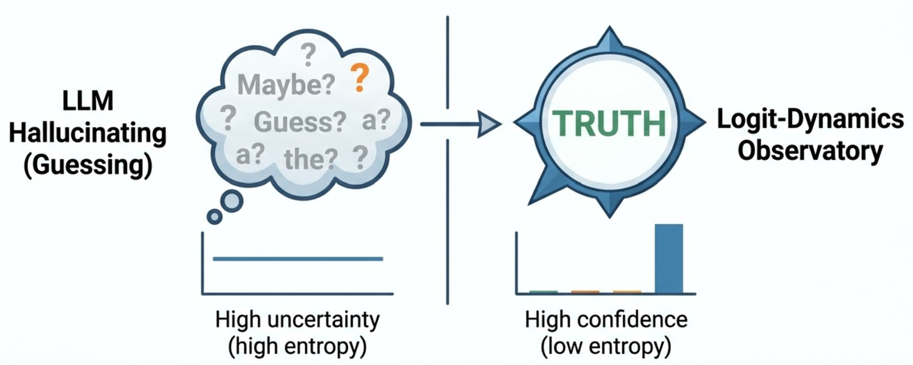

Published by Ramu Nalla - April 15, 2026

{width=60% fig-align="center"}

---

In modern Agentic architectures like LangGraph or CrewAI, the default engineering pattern is to route every single user prompt through a massive cloud LLM (GPT-4, Claude). 

As a system scales, this creates two massive bottlenecks: **unacceptable API costs** and **network latency**.

For my latest project, **BitRouter-158**, I decided to eliminate this dependency. Instead of calling the cloud to make a simple binary routing decision (e.g., "Is this a simple local query or a complex analytical request?"), I built an ultra-lightweight "Gatekeeper" model designed to run locally on a consumer CPU. 

**The catch?** Standard Float32 models are still too heavy for edge deployments. To fix this, I implemented the **BitNet b1.58** architecture from scratch in PyTorch, compressing the model's weights to strictly $\{-1, 0, 1\}$. 

Here is how I bypassed standard PyTorch limitations to achieve a **93.3% reduction in memory footprint**.

## The Architecture: Ternary Quantization

Standard neural networks store weights as 32-bit floating-point numbers. This requires the CPU to perform computationally expensive matrix multiplications. 

The BitNet 1.58b paradigm proves that LLMs do not need high-precision decimals to be "smart". By forcing the weights into three absolute states ($-1, 0, 1$), we transform complex matrix multiplication into highly efficient, native addition and subtraction operations.

### The Challenge: The Zero-Gradient Problem
You cannot just call `torch.round()` on your weights and expect a model to train. 
Rounding is a discrete step function. If you try to run Backpropagation through a step function, the derivative is **zero**. Gradients vanish instantly, and the model learns nothing.

### The Solution: The Straight-Through Estimator (STE)
To circumvent PyTorch's default Autograd engine, I engineered a custom `BitLinear` layer utilizing the **STE trick**. 

* **Forward Pass (Quantization):** Weights are dynamically scaled and forced into ternary states using clamping and rounding:
  $$W_{quant} = \text{Round}\left(\text{Clamp}\left(\frac{W}{\gamma}, -1, 1\right)\right)$$
* **Backward Pass (Gradient Bypass):** I overrode the autograd engine to act as an identity function during backpropagation. The gradients bypass the non-differentiable rounding step entirely and flow straight into the latent FP32 weights, allowing the optimizer to update them normally:
  $$\text{grad\_input} = \text{grad\_output}$$

[Insert BitLinear STE Python snippet here]

## Dynamic Bit-Mixing: Preserving the "Smartness"

Compressing an entire model to 1.58-bits degrades its ability to understand nuance. To maintain high accuracy on the Hugging Face `Banking77` dataset, I implemented **Dynamic Bit-Mixing** in the Transformer blocks:

* **Attention Heads (The Thinker):** Maintained in standard FP32 precision. Attention relies on delicate fractional probabilities (softmax) to map semantic relationships between words. Quantizing this destroys context.
* **Feed-Forward Networks (The Database):** Aggressively compressed to 1.58-bits. In a standard Transformer, the FFN contains roughly 70% of the parameter count. By targeting the FFN, we wipe out the bulk of the memory footprint while keeping the model's reasoning intact.

[Insert BitTransformer Block Python snippet here]

## LangGraph Integration: Making it Useful

A highly compressed model is useless if it just sits in a Jupyter Notebook. The true value of BitRouter-158 is its MLOps integration. 

I wrapped the PyTorch model into a state machine using **LangGraph**. The BitRouter acts as the primary conditional edge. It intercepts the prompt, calculates the mathematical intent, and physically diverts the execution flow in real-time. 

* **Output 0:** Route to a fast, local deterministic function.
* **Output 1:** Forward the heavy payload to a cloud API.

[Insert LangGraph routing logic snippet here]

## Benchmarking the Edge: A Lesson in MLOps Reality

To prove the viability of this architecture, I built a benchmarking suite pitting my BitRouter against a standard PyTorch `nn.Linear` model of identical dimensional scale. 

The results highlight a massive architectural win, but also a stark reality regarding high-level Python frameworks.

| **Metric** | **Standard Model (FP32)** | **BitRouter (1.58-bit)** |
| :--- | :--- | :--- |
| **RAM Footprint (MB)** | 41.16 MB | **2.77 MB** |
| **Latency (ms / token)** | 0.036 ms | 0.081 ms* |

* 🏆 **The Victory:** The BitRouter achieved a **93.3% memory footprint reduction**. This makes it trivial to deploy as a sidecar container on ultra-cheap edge hardware.
* ⚠️ **The Latency Tradeoff:** You might notice the 1.58-bit model was actually *slower* per token. This is the difference between algorithmic theory and hardware reality. PyTorch lacks native fused C++ kernels for 1.58-bit operations. Therefore, the "simulated" quantization overhead—running absolute means, clamps, and rounds in Python on every forward pass—masks the theoretical speedup of addition-only logic.

## Final Thoughts

BitRouter-158 proves that we do not need trillion-parameter cloud models for every step of an agentic workflow. By embracing ternary quantization, custom autograd logic, and edge-first routing, we can drastically reduce system costs while maintaining robust orchestration. 

To unlock the true hardware-level latency speedup, the next iteration of this project will require writing a custom C++ or Triton kernel to physically bypass the CPU's multiplication circuits. 

Check out the full repository, benchmarking suite, and mathematical breakdowns on my [GitHub](https://github.com/RamuNalla/BitRouter-158).