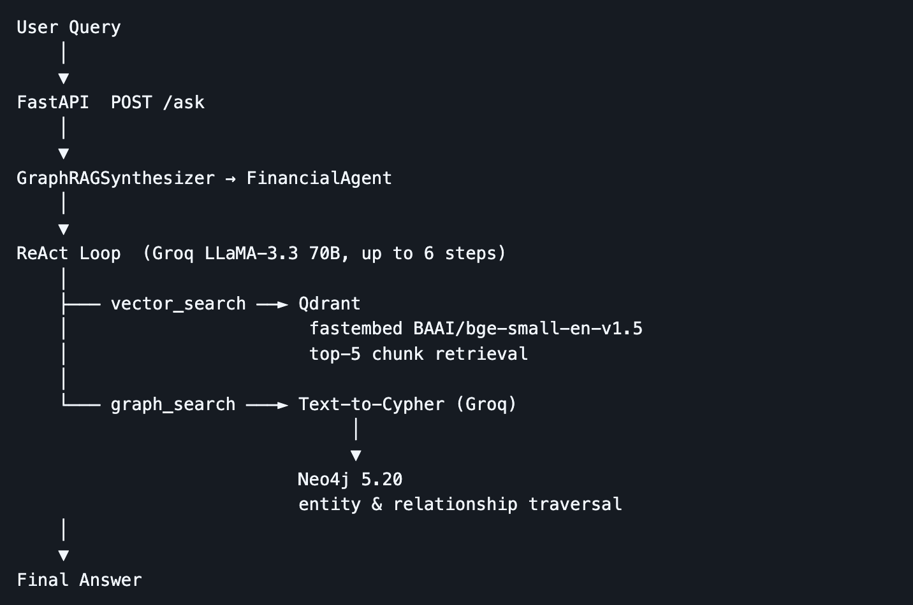
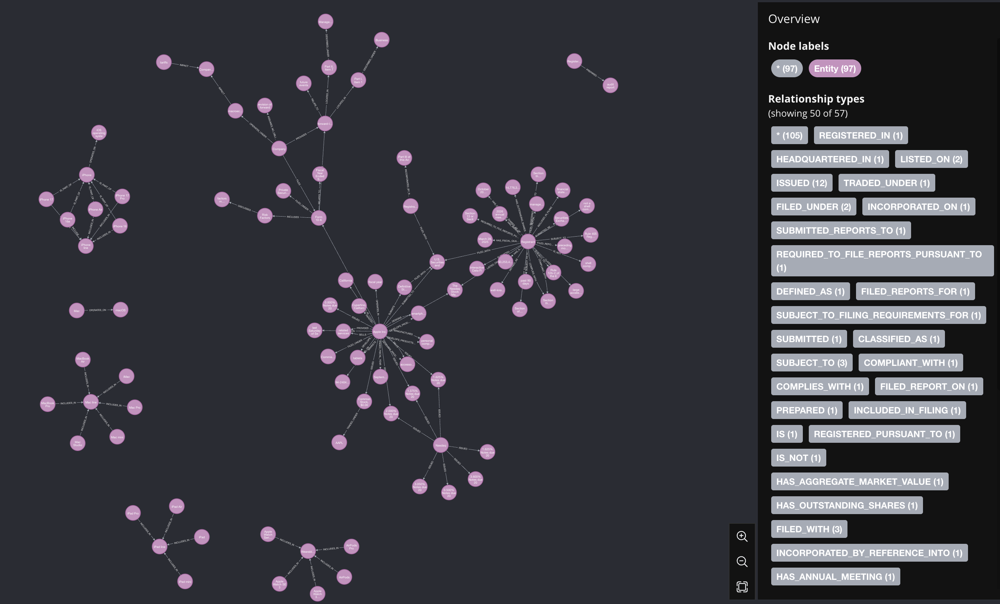
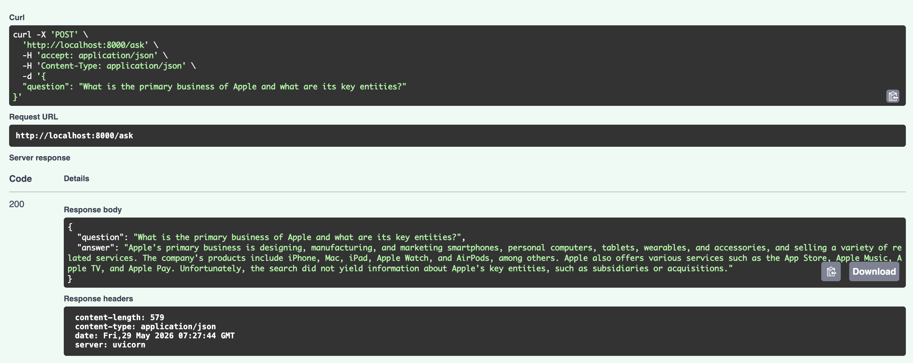

<div class="blog-manual-meta">Published by Ramu Nalla - June 2, 2026</div>

{width=80% style="margin: 20px auto; display: block;"}

---

If you feed an LLM a 150-page financial document and ask a simple question like, *"What was the total revenue?"*, standard Vector RAG works perfectly. 

But if you ask a multi-hop, relational question like, *"How did Microsoft's recent acquisitions affect the supply chain vulnerabilities of its cloud division?"*, standard Vector RAG fails miserably. It will retrieve a chunk about acquisitions, and a chunk about supply chains, but it cannot logically connect them. The AI gets "Lost in the Middle" of fragmented context.

Financial, legal, and medical documents are densely packed with entities and relationships. To reason over them, we cannot just rely on semantic text chunks. We need **Knowledge Graphs**. 

In this post, I will break down the architecture of **Nexus-GraphRAG**—an enterprise-grade microservice I built that parses SEC 10-K filings into a Neo4j graph database, embeds the text into a Qdrant vector database, and uses an intelligent ReAct agent to seamlessly route queries between the two.

## 1. Vector RAG vs. GraphRAG: Choosing the Right Tool

Before building, it is crucial to understand *why* we need a hybrid approach. Neither Vector databases nor Graph databases are silver bullets.

### Naive RAG (Vector Search)
Vector search converts text into high-dimensional numbers (embeddings). It finds context based on semantic closeness.

*   **Best For:** Simple fact retrieval, summarizing specific sections, and understanding general sentiment.
*   **Pros:** Highly scalable, easy to implement, handles messy/unstructured text beautifully.
*   **Cons:** Blind to structural dependencies. Cannot traverse multiple documents to connect entity A to entity C via entity B.

### GraphRAG (Knowledge Graphs)
GraphRAG uses LLMs to extract exact Entities (Nodes) and Relationships (Edges) from text, storing them in a graph database like Neo4j.

*   **Best For:** Multi-hop reasoning, mapping corporate hierarchies, supply chains, and complex dependencies.
*   **Pros:** Mathematically precise relationships. Eliminates hallucinated connections. Explains *how* things are related.
*   **Cons:** Expensive and slow to build (requires heavy LLM extraction upfront). Struggles with vague, highly abstract queries.

**The Hybrid Verdict:** Enterprise systems require both. You use Vector for the *semantic "What"* and Graph for the *relational "How"*.

## 2. Architecting Nexus-GraphRAG

To build a production-ready hybrid system, I separated the architecture into three distinct layers: Ingestion, Orchestration, and Deployment.

{width=50% style="margin: 20px auto; display: block;"}

1.  **The Ingestion Pipeline:** It reads the SEC PDFs. It chunks the text into Qdrant (Vector DB) and prompts Meta's Llama-3-70B to extract entities and build Cypher relationships in Neo4j (Graph DB).
2.  **The Agentic Brain (ReAct Router):** A dedicated Langchain Agent evaluates the user's prompt. It decides if the query requires a `Vector_Search_Tool` or a `Graph_Cypher_Tool`.
3.  **The API Gateway:** The entire engine is wrapped in a containerized FastAPI microservice, allowing any front-end to query the graph.

## 3. The Knowledge Extraction Pipeline

The hardest part of GraphRAG is the ETL process. Parsing financial jargon into strict nodes and edges requires a highly capable LLM.

Using LlamaIndex’s `PropertyGraphIndex`, I configured the extraction engine to process Apple and Microsoft's SEC 10-K filings. 

```python
# The Knowledge Graph Extraction Engine
index = PropertyGraphIndex.from_documents(
    sec_documents,
    property_graph_store=neo4j_graph_store,
    vector_store=qdrant_vector_store,
    kg_extractors=[
        # Forcing the LLM to map a maximum of 10 relationships per text chunk
        {"type": "llm", "llm": groq_llama3, "max_paths_per_chunk": 10}
    ]
)
```
This single process does dual-indexing. It populates Qdrant with the embeddings and Neo4j with the graph. 

### Visualizing the Graph
Once the ingestion finished, I ran a Cypher query in the Neo4j browser: `MATCH (n)-[r]->(m) RETURN n, r, m`. The result is a mathematically explorable map of corporate data.

{width=80% style="margin: 20px auto; display: block;"}

## 4. Building the "Brain": The ReAct Agent

Having two databases is useless if the system doesn't know which one to query. To solve this, I built a **ReAct (Reasoning and Acting) Agent**. 

I provided the Agent with two distinct tools and a strict system prompt: *"If the user asks a simple fact, use the Vector tool. If the user asks a relational question connecting multiple entities, use the Graph tool to generate a Cypher query."*

Here is a look at the agent's internal telemetry when asked a complex question:

```text
==================================================
[USER QUERY]: What entities or subsidiaries are related to Microsoft?
==================================================
Thought: The user is asking about entities and relationships connected to Microsoft. This requires structural mapping rather than semantic text matching. I should use the graph_search_tool.
Action: graph_search_tool
Action Input: {'input': 'What entities or subsidiaries are related to Microsoft?'}
Observation: (Neo4j executes Cypher query: MATCH (m:Company {name:"Microsoft"})-[r:OWNS|ACQUIRED]->(e) RETURN e)
Thought: I have found the related entities from the graph database.
[FINAL ANSWER]: Microsoft is structurally related to several key entities, including the recent acquisition of Activision Blizzard, LinkedIn, and Nuance Communications...
```

By allowing the LLM to "think" before acting, the system dynamically solves the routing problem with near-perfect accuracy.

## 5. Deployment: Containerized FastAPI

AI projects sitting in Jupyter Notebooks rarely make it to production. To ensure this architecture was enterprise-ready, I encapsulated the Agentic Synthesizer inside a **FastAPI** backend and orchestrated the entire stack (Neo4j, Qdrant, and the API) using `docker-compose`.

This creates a seamless "One-Command Setup". Typing `docker compose up -d` boots the entire microservice ecosystem.

{width=80% style="margin: 20px auto; display: block;"}

## 6. Quantitative Proof: GraphRAG vs Naive RAG

To definitively prove that the Hybrid architecture outperforms Naive RAG on complex documents, I ran both pipelines through the **Ragas** evaluation framework using a dataset of multi-hop financial questions.

The system was evaluated on 5 complex financial questions drawn from the Apple and Microsoft 10-K filings, comparing against a Naive RAG baseline. Naive RAG uses direct Qdrant retrieval with Anthropic `claude-sonnet-4-5` for generation — no graph, no agent. Evaluation was run with Ragas 0.4.3 using `claude-haiku-4-5` as the LLM judge.

::: {.blog-content-table}

| Metric | Naive RAG | Nexus GraphRAG | Delta |
|:---|:---:|:---:|:---:|
| Answer Correctness | 0.2804 | 0.2788 | −0.002 |
| **Answer Relevancy** | 0.1994 | **0.3856** | **+0.186** |
| Semantic Similarity | 0.6936 | 0.6657 | −0.028 |

:::

- **Answer Relevancy** is the clearest win (+0.19) — GraphRAG nearly doubles Naive RAG. Multi-hop questions on acquisitions and regulatory exposure benefit directly from graph traversal; the agent connects the right entities instead of just returning the nearest passage.
- **Answer Correctness** is a near-tie. Ground truths were written at summary level and both systems draw from the same corpus, so factual overlap ends up similar regardless of retrieval method.
- **Semantic Similarity** is marginally higher for Naive RAG — short dense passages match ground truth phrasing more closely than GraphRAG's longer, more discursive answers, even when the underlying facts are equivalent.

## Conclusion

The era of basic Vector RAG is evolving. As enterprises attempt to feed their AI systems highly complex, structured, and relational documents—like medical histories, legal contracts, or financial filings—Vector DBs alone are no longer sufficient.

By combining the semantic flexibility of Qdrant with the structural rigor of Neo4j, and orchestrating them via an intelligent ReAct agent, **Nexus-GraphRAG** proves that we can finally teach AI to connect the dots.

You can explore the extraction pipelines, the agentic routing logic, and the Docker deployment scripts in the [nexus-graphrag repository on GitHub](https://github.com/RamuNalla/nexus-graphRAG).
