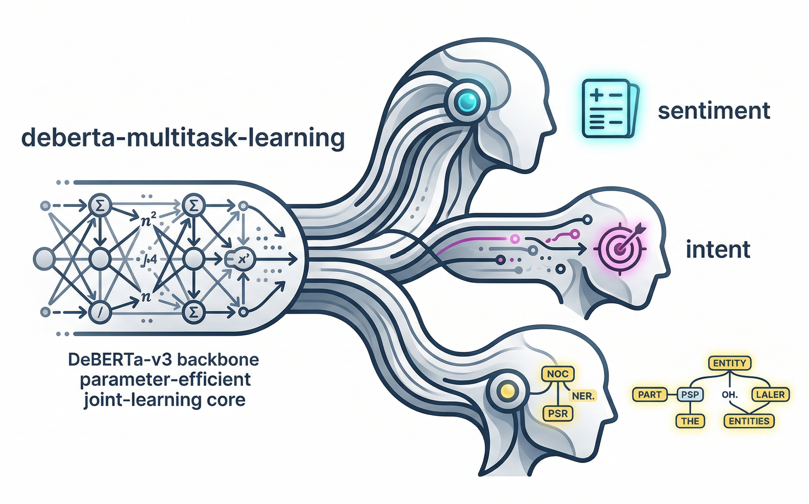

<div class="blog-manual-meta">Published by Ramu Nalla - March 1, 2026</div>

{width=60% fig-align="center"}

---

Standard NLP pipelines treat language understanding as a fragmented assembly line. If you want to extract sentiment, classify user intent, and run Named Entity Recognition (NER), the industry default is usually to load three entirely separate models into memory. It is computationally expensive, redundant, and ignores the fact that these tasks fundamentally rely on the exact same contextual understanding of a sentence.

For my latest project, I decided to consolidate. 

**The goal?** Build a single, highly optimized PyTorch architecture that routes semantic embeddings to three distinct, task-specific prediction heads simultaneously—all in a single forward pass.

## The Architecture: One Brain, Three Heads

To pull this off, I bypassed standard single-task pipelines and built a custom multi-task router on top of **DeBERTa-v3**. DeBERTa's disentangled attention mechanism separates word content from word position, yielding incredibly rich representations that are perfect for complex, token-heavy tasks.

### The Catastrophic Forgetting Problem
When you try to fine-tune a massive 130M+ parameter model on three conflicting tasks simultaneously, you almost always trigger catastrophic forgetting. The network's foundational knowledge gets overwritten by the aggressive gradient updates of the new data.

To prevent this, I froze the base model entirely and utilized **LoRA (Low-Rank Adaptation)**.

```python
from transformers import AutoModel
from peft import LoraConfig, get_peft_model

# 1. Load the shared foundational backbone
base_model = AutoModel.from_pretrained("microsoft/deberta-v3-base")

# 2. Inject LoRA adapters to make training parameter-efficient
lora_config = LoraConfig(
    r=8, 
    lora_alpha=16, 
    target_modules=["query_proj", "value_proj"], 
    lora_dropout=0.1,
    bias="none"
)
encoder = get_peft_model(base_model, lora_config)
```

By injecting tiny rank-8 matrices exclusively into the Query and Value projections of the attention layers, the model learns the new tasks using only ~0.6% of its total parameters. This preserves the base intelligence of DeBERTa while making the training loop highly memory-efficient.

### The Dynamic Router
During the forward pass, the tensors don't just blindly flow into every layer. A custom `MultiTaskBatchSampler` tags the data, and the network dynamically routes the sequence. For sentence-level tasks (Sentiment and Intent), it extracts the `[CLS]` token equivalent. For token-level tasks (POS Tagging), it passes the entire sequence matrix.

## The Math: Taming Conflicting Gradients

Building the architecture is the easy part. The real engineering challenge in Multi-Task Learning is the loss function. 

If you simply add the losses together ($L_{total} = L_{sentiment} + L_{intent} + L_{pos}$), your model will fail. Why? Because a token-level task like POS Tagging calculates error across 128 tokens per sentence, generating a massive, noisy loss. A binary task like Sentiment Analysis generates a tiny scalar loss.

When PyTorch runs backpropagation, the massive POS gradient will completely drown out the Sentiment and Intent gradients. The network becomes a one-trick pony.

### Homoscedastic Task Uncertainty Weighting
To fix this, I implemented a 2017 mathematical technique called Homoscedastic Task Uncertainty Weighting. Instead of manually guessing static weights for each task, we force the neural network to *learn* the optimal balance dynamically.

I introduced a learnable noise parameter, $\sigma$, for each task. To ensure mathematical stability and prevent negative variance, it actually learns the log-variance: $s = \log(\sigma^2)$.

The final weighted loss formula looks like this:

$$L_{total} = \sum_{i=1}^{T} \left( e^{-s_i} L_i + s_i \right)$$

```python
import torch
import torch.nn as nn

class UncertaintyLoss(nn.Module):
    """
    Implements Homoscedastic Task Uncertainty Weighting.
    Automatically balances the gradients of multiple tasks during joint training.
    """
    def __init__(self, num_tasks: int = 3):
        super(UncertaintyLoss, self).__init__()
        # Initialize log variances at 0 (meaning variance = 1)
        # We use log variance for numerical stability to avoid division by zero
        self.log_vars = nn.Parameter(torch.zeros(num_tasks))

    def forward(self, losses: list[torch.Tensor]) -> torch.Tensor:
        if len(losses) != len(self.log_vars):
            raise ValueError("Number of losses must match number of tasks.")

        total_loss = 0
        for i, loss in enumerate(losses):
            # L_i * exp(-log_var) + log_var
            precision = torch.exp(-self.log_vars[i])
            total_loss += (precision * loss) + self.log_vars[i]

        return total_loss
```
**How it works:** If a task (like POS Tagging) is generating a massive, noisy loss, the network actively increases its $s$ parameter. This shrinks the $e^{-s}$ multiplier, suppressing that specific gradient and allowing the quieter tasks (Sentiment/Intent) to actually influence the shared LoRA weights. The $+ s_i$ at the end acts as a penalty so the network can't just push the variance to infinity.

## Hardware Optimization: The TPU/GPU Pipeline

Because I wanted this to train seamlessly on both standard NVIDIA GPUs and Google Cloud TPUs (PyTorch/XLA), the data pipeline had to be ruthlessly strict. 

TPUs act as strict C++ compilers. If you feed them dynamically sized batches (e.g., a sentence of 45 tokens, then a sentence of 62 tokens), the TPU halts and recompiles the entire mathematical graph, slowing training to a crawl. 

To guarantee hardware stability, I enforced three strict rules in the `data.py` pipeline:

1. **Strict Max-Length Padding:** Every single sentence across all three datasets is padded or truncated to exactly 128 tokens.
2. **Dropping Incomplete Batches:** Appending `drop_last=True` to the DataLoaders ensures the final, uneven batch of an epoch is thrown away, protecting the XLA graph.
3. **Subword Alignment:** POS tags are mapped precisely to the first subword of DeBERTa's tokenizer, forcefully assigning a $-100$ ignore-index to trailing subwords to bypass PyTorch's Cross-Entropy loss calculation.

## The Interactive Dashboard

To prove the single-pass architecture works, I deployed the trained LoRA adapters into a custom Streamlit dashboard. 

{width=80% fig-align="center"}

```python
import streamlit as st
import torch
from transformers import AutoTokenizer
from model import DebertaMultiTaskModel

# --- 1. Load Architecture (Cached for Speed) ---
@st.cache_resource
def load_architecture():
    device = torch.device("cuda" if torch.cuda.is_available() else "cpu")
    tokenizer = AutoTokenizer.from_pretrained("microsoft/deberta-v3-base")
    
    model = DebertaMultiTaskModel().to(device)
    model.encoder.load_adapter("./mtl_lora_adapters", "default")
    model.eval()
    return tokenizer, model, device

tokenizer, model, device = load_architecture()

# --- 2. The Unified Forward Pass ---
st.title("🧠 Multi-Task NLU Engine")
user_input = st.text_area("Enter text for analysis:")

if st.button("Run Joint Inference"):
    inputs = tokenizer(user_input, return_tensors="pt", padding=True, truncation=True, max_length=128)
    input_ids = inputs["input_ids"].to(device)
    attention_mask = inputs["attention_mask"].to(device)

    with torch.no_grad():
        # Route tensors through the shared encoder to the three distinct heads
        sentiment_logits = model(input_ids, attention_mask, task_name="sentiment")
        intent_logits = model(input_ids, attention_mask, task_name="intent")
        pos_logits = model(input_ids, attention_mask, task_name="pos")

    # --- 3. Render Results ---
    sentiment_label = "Positive" if torch.argmax(sentiment_logits, dim=-1).item() == 1 else "Negative"
    st.metric(label="Predicted Sentiment", value=sentiment_label)
    
    # (Intent and POS decoding rendered similarly below...)
```

When you input a complex user query, the application routes the tensors through the shared DeBERTa encoder and fires all three heads simultaneously, rendering Sentiment, Banking Intent, and Named Entity tags in milliseconds.

## Final Thoughts

Multi-Task Learning forces you to think beyond just stacking PyTorch layers. By managing catastrophic forgetting with PEFT, stabilizing XLA compilation with strict data pipelines, and dynamically balancing gradients with log-variance math, you can build incredibly efficient NLU engines that do more with less compute.

Check out the full repository, training loops, and mathematical breakdowns on my [GitHub](https://github.com/RamuNalla/deberta-multitask-learning).