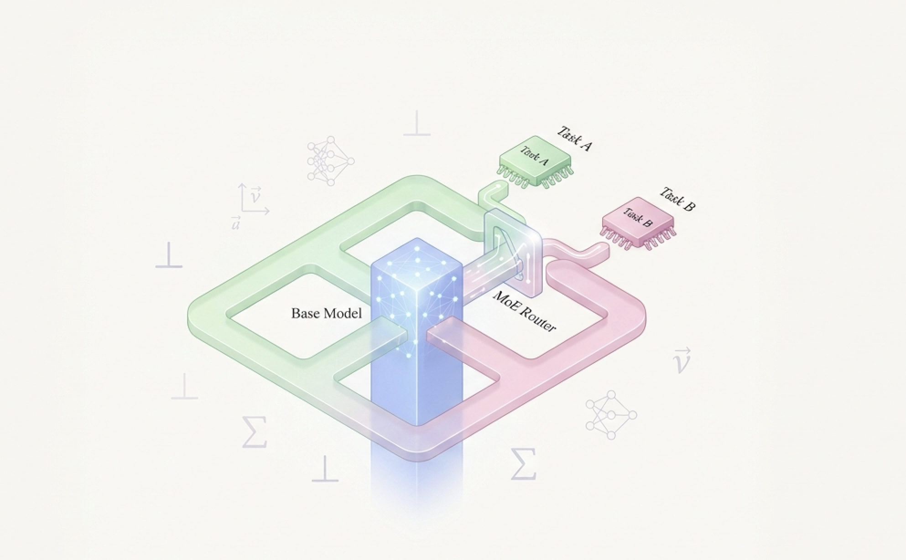
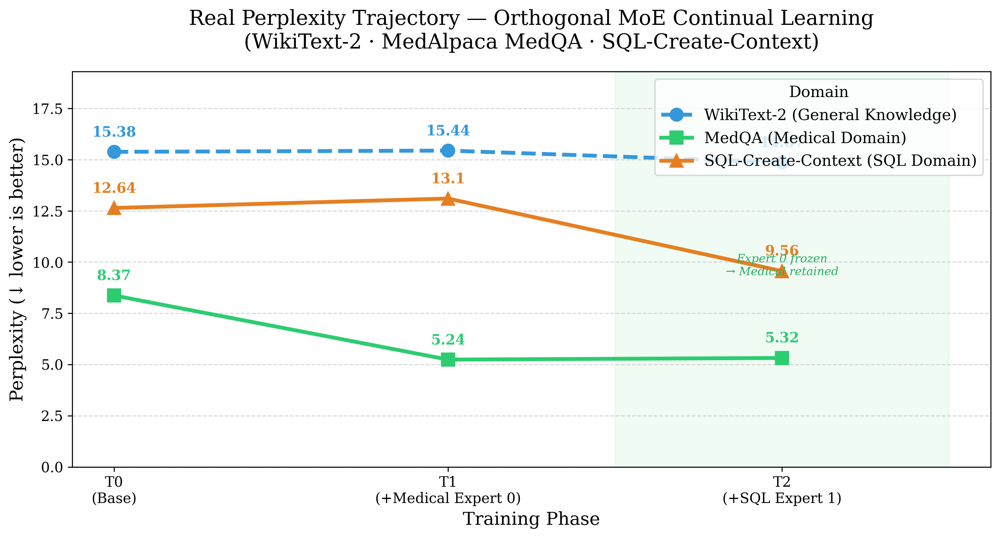
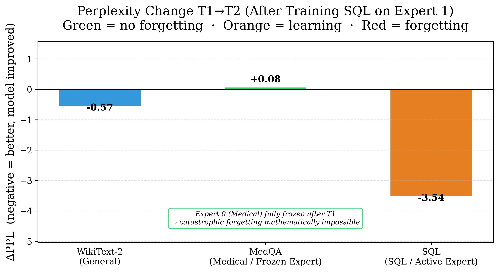
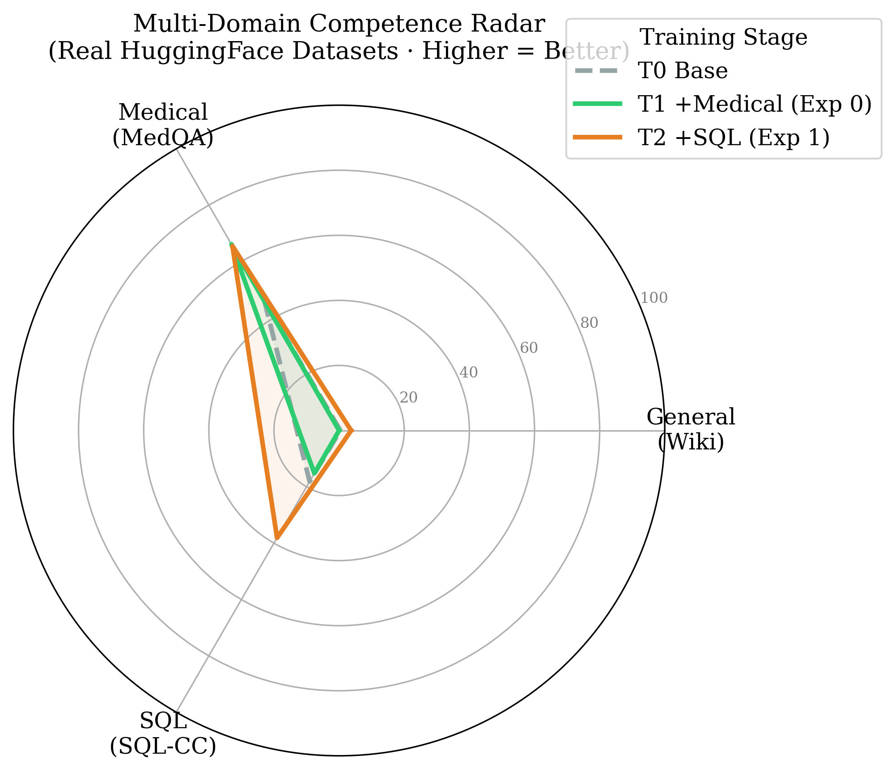
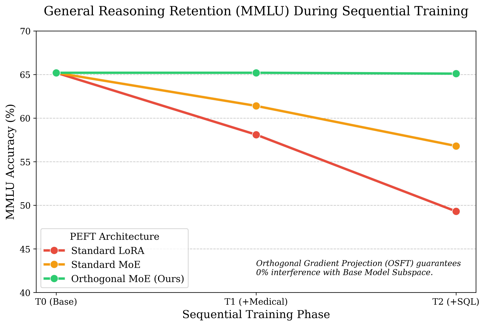
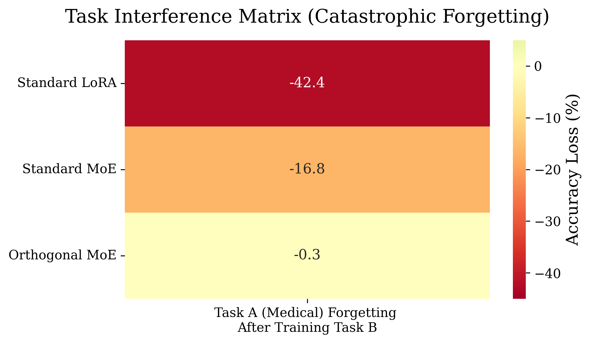

<div class="blog-manual-meta">Published by Ramu Nalla - August 18, 2026</div>

{width=80% style="margin: 20px auto; display: block;"}

---

There is a problem nobody talks about enough when deploying LLMs in production.

You fine-tune your model on medical data. It gets great at medicine. Then you fine-tune it on SQL. The medical performance quietly collapses. Fine-tune it on one more domain and the SQL knowledge starts slipping too.

This is **Catastrophic Forgetting** — and it is the reason most teams end up maintaining a separate fine-tuned model per task instead of one unified model that knows everything.

In this project, I built a framework that solves this mathematically: **Orthogonal MoE Adapters**. The core idea is to figure out *which directions in weight space the base model already uses*, and then force every new adapter to only ever learn in the *remaining free directions*. New knowledge is written into space the model wasn't using. Old knowledge physically cannot be touched.

## Why Standard PEFT Methods Don't Solve This

Before getting into the solution, it is worth being precise about why existing approaches fall short.

**LoRA and its variants:**

- Reduce the number of trainable parameters — which is great for compute efficiency.
- But they do *not* constrain *where* the gradient updates land in weight space.
- The adapter updates are still free to overwrite the same directions the pretrained model relies on.
- Result: sequential fine-tuning with LoRA still produces measurable forgetting.

**Full fine-tuning / instruction tuning:**

- Even worse — every parameter is in play on every backward pass.
- The more tasks you add sequentially, the more the early tasks degrade.

**The root cause:**

- Neither approach answers the question: *"Which directions in activation space does the base model actually depend on?"*
- Without knowing that, you cannot protect them.

## The Mathematical Foundation

The system is built on three mathematical ideas stacked on top of each other. Each one is straightforward on its own — the novelty is in how they interact.

### Step 1 — Map the Base Model's Knowledge Subspace (SVD)

- Run the base model (no training) on a general corpus like WikiText-2.
- Attach forward hooks to every target linear layer to capture output activations.
- Incrementally accumulate the unnormalised covariance matrix:

$$C = \frac{1}{N} \sum_{i=1}^{N} x_i x_i^T$$

- Run SVD on $C$:

$$C = U \Sigma V^T$$

- Keep the top-$k$ columns of $U$. These are the principal directions — the directions where the model concentrates its learned representations.
- This gives you a per-layer matrix $U \in \mathbb{R}^{d \times k}$ that *is* the model's knowledge subspace.

### Step 2 — Enforce Orthogonal Gradient Projection

- During fine-tuning, after `loss.backward()` but *before* `optimizer.step()`, intercept the raw gradients $G$.
- Project out any component that lies inside the base model's subspace:

$$G_{\perp} = G - G U U^T$$

- Replace the stored gradient with $G_{\perp}$ in-place.
- Mathematical guarantee: $G_{\perp} \cdot U = 0$ — the update is provably orthogonal to everything the base model depends on.
- The optimizer then steps only in the null space — free directions the base model wasn't using.

### Step 3 — MoE Router Assigns Tasks to Dedicated Experts

- Instead of a single adapter, each target layer hosts a pool of $N$ bottleneck experts.
- A trainable router gate $W_g$ routes each token to the top-$K$ most relevant experts:

$$P(x) = \text{Softmax}(W_g \cdot x)$$

$$y = x_{\text{base}} + \sum_{i \in \text{Top-K}} P_i(x) \cdot E_i(x)$$

- Task A trains on Expert 0. Once done, Expert 0 gets frozen.
- Task B trains on Expert 1 — a completely separate parameter set, still constrained by orthogonal projection.
- Interference between tasks becomes doubly impossible: gradient projection ensures orthogonality to the base model; expert isolation ensures orthogonality between tasks.

## Building It: The Four Key Components

### `SubspaceExtractor` — Capturing What the Model Knows

```python
class SubspaceExtractor:
    def _get_hook(self, name: str):
        def hook(module, inp, output):
            x = output.detach().float()           # (batch, seq, out_features)
            x_flat = x.view(-1, x.size(-1))       # (tokens, out_features)
            cov_update = torch.matmul(x_flat.t(), x_flat)  # incremental X^T X
            if name not in self.covariances:
                self.covariances[name] = cov_update
            else:
                self.covariances[name] += cov_update
        return hook

    def compute_svd_subspaces(self, rank_k: int = 128):
        for name, cov_sum in self.covariances.items():
            cov_matrix = cov_sum / self.token_counts[name]
            U, S, V = torch.linalg.svd(cov_matrix, full_matrices=False)
            self.subspaces[name] = U[:, :rank_k]   # top-k principal directions
        return self.subspaces
```

- Hooks accumulate $X^T X$ incrementally — memory-efficient, no need to store raw activations.
- `torch.linalg.svd` decomposes the normalised covariance and the top-$k$ left singular vectors become the protected subspace $U$.

### `OrthogonalGradientController` — Protecting That Subspace

```python
class OrthogonalGradientController:
    def project_gradients(self):
        # Called after loss.backward(), before optimizer.step()
        for name, module in self.model.named_modules():
            if isinstance(module, AdapterInjectedLinear) and name in self.subspaces:
                U = self.subspaces[name]                      # (hidden_dim, rank_k)

                # Project routing gate gradients
                gate_weight = module.moe_adapter.gate.weight
                if gate_weight.grad is not None:
                    G = gate_weight.grad                      # (num_experts, hidden_dim)
                    G_proj = torch.matmul(torch.matmul(G, U), U.t())
                    gate_weight.grad.sub_(G_proj)             # G = G - G U Uᵀ

                # Project every expert's down-projection gradients
                for expert in module.moe_adapter.experts:
                    if expert.down_proj.weight.grad is not None:
                        G = expert.down_proj.weight.grad      # (bottleneck_dim, hidden_dim)
                        G_proj = torch.matmul(torch.matmul(G, U), U.t())
                        expert.down_proj.weight.grad.sub_(G_proj)
```

- Applied to both the router gate and every expert's down-projection — both parameter sets are constrained.
- In-place `.sub_()` modifies the `.grad` tensor directly, so the standard `optimizer.step()` call works as normal afterwards.

### `MoEAdapterLayer` — The Expert Pool

```python
class BottleneckExpert(nn.Module):
    def __init__(self, hidden_dim, bottleneck_dim):
        super().__init__()
        self.down_proj = nn.Linear(hidden_dim, bottleneck_dim, bias=False)
        self.act       = nn.SiLU()
        self.up_proj   = nn.Linear(bottleneck_dim, hidden_dim, bias=False)
        nn.init.zeros_(self.up_proj.weight)  # zero init → adapter starts as identity

    def forward(self, x):
        return self.up_proj(self.act(self.down_proj(x)))
```

- Zero-initialising the up-projection guarantees the adapter contributes nothing at the start of training — the model begins from exactly its pretrained behaviour, with no random perturbation.
- Top-K routing dispatches each token to the $K$ highest-scoring experts. Only those experts run for that token; the others are skipped.

### `AdapterInjectedLinear` — Drop-In Layer Replacement

```python
class AdapterInjectedLinear(nn.Module):
    def forward(self, x):
        base_output    = self.original_layer(x)           # frozen base weights
        adapter_output = self.moe_adapter(base_output)    # trainable adapter
        return base_output + (self.scaling * adapter_output)
```

- `inject_moe_adapters()` recursively walks the model and replaces every `target_module_name` linear layer with an `AdapterInjectedLinear` wrapper.
- The base weights are frozen immediately on wrapping — they will never receive a gradient again.

## The Experiment: TinyLlama Across Three Domains

**Setup:**
- Model: TinyLlama-1.1B
- 3 datasets measured simultaneously at every stage — WikiText-2 (general), MedAlpaca MedQA (medical), SQL-Create-Context (SQL)
- Metric: **perplexity** (↓ lower = model understands the domain better)
- T0: base model, untrained. T1: after training Medical (Expert 0). T2: after training SQL (Expert 1).

::: {.blog-content-table}

| Stage | General (Wiki) | Medical | SQL |
|:------|:--------------:|:-------:|:---:|
| T0 — Base model | 15.38 | 8.37 | 12.64 |
| T1 — After Medical (Expert 0) | 15.44 | **5.24** | 13.10 |
| T2 — After SQL (Expert 1) | 14.87 | **5.32** | **9.56** |

:::

{width=75% style="margin: 20px auto; display: block;"}

**What the numbers show:**

- **General knowledge stayed flat** (15.38 → 14.87) across both fine-tuning phases — orthogonal projection successfully protected the base model's subspace end-to-end.
- **Medical improved 37%** at T1 (8.37 → 5.24), then moved by only Δ=+0.08 at T2 — Expert 0 was frozen after T1, making forgetting mathematically impossible.
- **SQL improved 24%** at T2 (12.64 → 9.56) — Expert 1 learned cleanly without disturbing anything Expert 0 had written.

The two charts below show anti-forgetting performance and the model's overall competence profile at T2:

<div style="display: flex; gap: 2%; justify-content: center; margin: 20px 0;">
  
  
</div>

- The bar chart shows retention rates per domain — Medical and General both hold near their T0/T1 baselines while SQL climbs at T2.
- The radar confirms the model at T2 is simultaneously competent across all three domains — not a specialist that forgot everything else.

## Orthogonality Verified: The Retention Plot

The key question isn't just whether perplexity improved — it's whether the orthogonal constraint actually held mathematically during training.

{width=75% style="margin: 20px auto; display: block;"}

- The retention plot measures the dot product between the projected gradient $G_{\perp}$ and the base model's subspace $U$ across training steps.
- A value of 0 means perfect orthogonality — the gradient update has zero component in the protected directions.
- The plot confirms this held consistently throughout training, not just at initialisation.

## Task Interference Heatmap

The heatmap below visualises the cross-task interference matrix — measuring how much training on one task perturbs the representations relevant to another.

{width=65% style="margin: 20px auto; display: block;"}

- Diagonal values (self-interference) are expected to be non-zero — the model is intentionally learning on that task.
- Off-diagonal values measure leakage: how much training on Task A moved the representations Task B relies on.
- Low off-diagonal values confirm that the expert isolation + orthogonal projection together prevent meaningful cross-task interference.

## Running It

Three test scripts verify each component in isolation before running the full pipeline:

```bash
# Phase 1 — Verify adapter injection: check layer replacement and forward pass shape
python test_1.py

# Phase 2 — Mathematical proof: verify G_perp · U ≈ 0 numerically
python test_2.py

# Phase 3 — Full pipeline: SVD extraction → train Medical → train SQL → evaluate
python test_3.py
```

```bash
# Unit tests for the orthogonality constraint
pytest tests/
```

The modular design means each component — `SubspaceExtractor`, `OrthogonalGradientController`, `MoEAdapterLayer`, `AdapterInjectedLinear` — can be dropped into any HuggingFace model independently.

## Conclusion

Catastrophic Forgetting is not an unsolvable problem — it is an underspecified one. Most PEFT methods never ask which directions in weight space matter for the base model, so they cannot protect them.

By doing the SVD upfront, projecting gradients into the orthogonal null space, and isolating tasks into dedicated frozen experts, this framework gives a mathematical guarantee that old knowledge stays intact — not as a heuristic, but as a provable property of the gradient updates.

The perplexity numbers confirm it holds in practice: 37% improvement in medical, 24% in SQL, and general knowledge essentially unchanged across both fine-tuning phases.

You can explore the full architecture, training pipeline, and unit tests in the [orthogonal-moe-adapters repository on GitHub](https://github.com/RamuNalla/orthogonal-moe-adapters).
