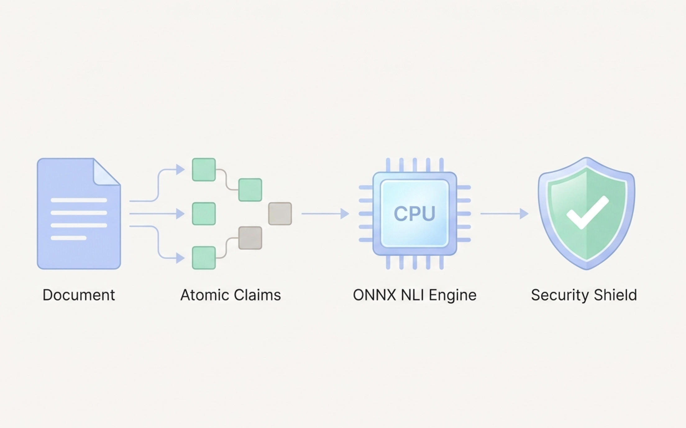
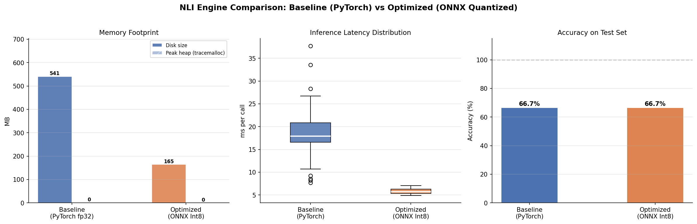
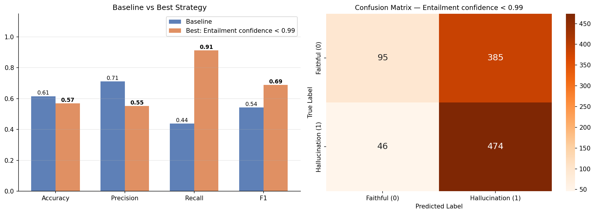

<div class="blog-manual-meta">Published by Ramu Nalla - July 29, 2026</div>

{width=80% style="margin: 20px auto; display: block;"}

---

The standard solution for detecting hallucinations in a RAG pipeline is to use a second LLM as a judge: feed the original context and the generated answer to a powerful model and ask it, *"Is this grounded?"*

The problem? It is slow, expensive, and the judge itself can hallucinate. You are fighting fire with fire.

**RAG-Guard NLI** takes a fundamentally different approach. Instead of a second LLM, it uses a **Cross-Encoder NLI model** (DeBERTa-v3-small) to verify factual grounding at the claim level. By applying **INT8 Dynamic Quantization** and exporting to **ONNX Runtime**, the pipeline runs at ~6 ms per claim on a standard CPU — faster than most cloud API round-trips — with a **3.19× latency speedup** and **70% model size reduction** at zero accuracy cost.

## The "LLM-as-a-Judge" Problem

The most common pattern for RAG evaluation today looks roughly like this: call GPT or Claude, give it the source document and the generated answer, and ask for a hallucination verdict. It works well enough in research settings, but it breaks down in production for three reasons.

**1. Cost.** Running a frontier LLM call for every single generated response is expensive at scale. A company processing thousands of RAG queries per day adds significant per-token overhead just for the evaluation layer.

**2. Latency.** An additional API round-trip adds hundreds of milliseconds. In a real-time or streaming application, that is unacceptable.

**3. Recursion.** The judge is itself an LLM, which means it can hallucinate its own verdict. You have not eliminated the problem — you have added an extra layer with the same failure mode.

What we actually need is a model that was **trained specifically to reason about entailment** — to classify whether a hypothesis is supported, contradicted, or unrelated to a given premise. That is exactly what Natural Language Inference (NLI) models do.

## The NLI Approach: Atomic Claim Verification

Natural Language Inference is a supervised classification task. Given a **premise** (source document sentence) and a **hypothesis** (LLM-generated claim), the model outputs one of three labels:

- **Entailment** — the premise logically supports the hypothesis. The claim is grounded.
- **Contradiction** — the premise actively contradicts the hypothesis. This is a hallucination.
- **Neutral** — the premise neither supports nor refutes the hypothesis. The claim is unverifiable from the given source.

The key insight is to **decompose** the LLM's response into atomic claims first, then verify each claim independently. A single fabricated number buried inside an otherwise-correct paragraph will not hide — every sentence gets its own verdict.

### Why a Cross-Encoder, Not a Bi-Encoder?

This is the most important architectural decision in the system. There are two fundamentally different ways to compute a relationship score between two text sequences.

**Bi-Encoder** (like the MiniLM model used in the Semantic Router):
- Encodes each sentence **independently** into a fixed-size dense vector; similarity is cosine distance between the two vectors.
- Extremely fast — embeddings can be pre-computed and cached at ingestion time.
- Critical limitation: the two sequences never *see* each other during encoding, so the model has no mechanism to reason about token-level interactions between the premise and the hypothesis.

**Cross-Encoder** (used for NLI inference):

- Concatenates both sequences and feeds the full joint input — `[CLS] premise [SEP] hypothesis [SEP]` — into the transformer in a single forward pass.
- Every attention head in every layer can attend across both sequences simultaneously, enabling direct token-level comparison (e.g. *"grew by 20%"* vs *"grew by 200%"*) with very high confidence.
- Tradeoff: cannot be pre-cached and scales as $O(n \times m)$ with $n$ claims and $m$ source sentences — which is exactly why the Semantic Router stage exists, reducing $m$ from the full document size down to top-k=2 sentences to keep it economically viable.

### Why DeBERTa-v3?

`cross-encoder/nli-deberta-v3-small` is fine-tuned on the NLI task using Microsoft's **DeBERTa-v3** architecture. DeBERTa improves on standard BERT/RoBERTa in two ways that are critical for entailment detection.

**1. Disentangled Attention:**

- Standard transformers encode each token as a single vector that conflates *content* (what the token means) and *position* (where it appears in the sequence).
- DeBERTa disentangles these into two separate embedding matrices — a content vector $H_i$ and a relative position vector $P_{i|j}$ — computing attention scores using all four cross-interaction terms:

$$A_{i,j} = H_i W_q (H_j W_k)^T + H_i W_q (P_{i|j} W_k)^T + P_{i|j} W_q (H_j W_k)^T$$

- This makes DeBERTa far more sensitive to relative word order — critical for catching contradictions like *"grew by 20%"* vs *"grew by 200%"* where a single token difference changes the entailment label entirely.

**2. Enhanced Mask Decoder (v3):**

- Adopts the replaced token detection pre-training objective from ELECTRA rather than masked language modelling.
- The generator-discriminator setup produces substantially stronger contextual token representations for downstream fine-tuning.

**NLI fine-tuning:**

- A linear classification head is appended on top of the `[CLS]` token representation.
- Fine-tuned on SNLI, MultiNLI, and related corpora to output three logits mapped through softmax to probabilities over `{Contradiction, Entailment, Neutral}`.

### The Three-Stage Pipeline

The full RAG-Guard pipeline has three sequential stages, each solving a specific problem:

```
Generated Text + Source Document
          │
          ▼
   ClaimExtractor  (spaCy sentencizer)
   → ["Claim 1", "Claim 2", ...]            # granularity: sentence-level atomic facts
          │
          ▼  (per claim)
   SemanticRouter  (MiniLM Bi-Encoder)
   → Top-k most relevant source sentences   # reduces Cross-Encoder input from O(C×S) to O(C×k)
          │
          ▼
   NLIEngine  (DeBERTa-v3 Cross-Encoder, INT8 ONNX)
   → Entailment / Contradiction / Neutral + calibrated confidence score
          │
          ▼
   [ { claim, matched_context, nli_label, confidence }, ... ]
```

**Stage 1 — Claim Extraction:**

- `spaCy`'s rule-based sentencizer splits the generated response using punctuation and dependency heuristics.
- Each resulting sentence becomes one independently verifiable atomic claim.
- Granularity is deliberate: paragraph-level NLI is less reliable because a single contradiction can be diluted by surrounding correct statements — sentence-level decomposition forces every factual assertion to earn its own verdict.
- A minimum-length filter (`len > 5` chars) discards noise fragments like *"However."* that carry no verifiable content.

**Stage 2 — Semantic Routing:**

- Naively passing every claim against every source sentence makes the NLI stage $O(C \times S)$ — for a 10-page document with 200 source sentences and a 5-claim response, that is 1,000 Cross-Encoder calls. Unacceptable.
- The Semantic Router solves this with a batched Bi-Encoder pass: source sentence embeddings are pre-computed and cached at ingestion time; only the incoming claim is encoded at query time.
- Cosine similarity across all source sentences is a single matrix multiply:

$$\text{sim}(\mathbf{c}, \mathbf{s}_i) = \frac{\mathbf{c} \cdot \mathbf{s}_i}{\|\mathbf{c}\| \|\mathbf{s}_i\|}$$

- `torch.topk` selects the top-k=2 highest-scoring sentences, concatenated into a single premise string — reducing Cross-Encoder workload from $O(C \times S)$ to $O(C \times k)$, from 1,000 calls to just 5 in the example above.
- The Bi-Encoder optimises for *recall at k=2*; precision is fully delegated to the Cross-Encoder downstream.

**Stage 3 — NLI Inference:**

- The Cross-Encoder receives the concatenated premise and the claim as a token pair: `[CLS] <top-2 source sentences> [SEP] <claim> [SEP]`.
- The full joint sequence passes through DeBERTa's 6-layer transformer in one forward pass, with every attention head able to cross-attend between premise and hypothesis tokens.
- The `[CLS]` hidden state is projected by a linear classification head to 3 logits, normalised by softmax into a probability distribution over `{Contradiction, Entailment, Neutral}`.
- ONNX Runtime executes the INT8-quantized graph on CPU in ~5.8 ms average, under 7 ms at p95.

## Building the Pipeline

Here is how the orchestrator wires the three stages together in `src/core.py`. Note that both the generated response *and* the source document pass through `ClaimExtractor` — splitting the source into discrete sentences gives the Semantic Router a set of independently-embeddable units to search over rather than one large string blob:

```python
class RAGGuardPipeline:
    def __init__(self):
        self.extractor  = ClaimExtractor()      # spaCy sentencizer
        self.router     = SemanticRouter()      # MiniLM Bi-Encoder
        self.nli_engine = OptimizedNLIEngine()  # DeBERTa Cross-Encoder, ONNX INT8

    def evaluate(self, generated_text, source_text):
        claims           = self.extractor.extract(generated_text)   # list of claim strings
        source_sentences = self.extractor.extract(source_text)      # list of source strings

        results = []
        for claim in claims:
            # Stage 2: narrow search space to top-k=2 source sentences via Bi-Encoder
            premise = self.router.get_top_k_context(claim, source_sentences, top_k=2)
            # Stage 3: joint cross-attention over premise × claim → NLI classification
            label, confidence = self.nli_engine.check_entailment(premise, claim)
            results.append({
                "claim":           claim,
                "matched_context": premise,
                "nli_label":       label,
                "confidence":      round(confidence, 4)
            })
        return results
```

### Semantic Router: Batched Bi-Encoder Retrieval

The router encodes all source sentences in a single batched call (cheap, pre-cacheable), then computes a full cosine similarity matrix against the incoming claim vector in one BLAS operation via `util.cos_sim`:

```python
class SemanticRouter:
    def __init__(self, model_name="all-MiniLM-L6-v2"):
        # MiniLM produces 384-dim unit-normalised embeddings
        self.model = SentenceTransformer(model_name, device=self.device)

    def get_top_k_context(self, claim, source_sentences, top_k=2):
        claim_emb   = self.model.encode(claim, convert_to_tensor=True)            # (384,)
        source_embs = self.model.encode(source_sentences, convert_to_tensor=True) # (S, 384)

        # cos_sim returns (1, S) — one score per source sentence
        cosine_scores = util.cos_sim(claim_emb, source_embs)[0]   # (S,)

        # Select the top-k highest-scoring source sentences
        top_results   = torch.topk(cosine_scores, k=min(top_k, len(source_sentences)))
        best_sentences = [source_sentences[idx] for idx in top_results.indices]

        # Concatenate into a single premise string for the Cross-Encoder
        return " ".join(best_sentences)
```

`all-MiniLM-L6-v2` is chosen deliberately over larger models like `all-mpnet-base-v2`: it produces 384-dimensional embeddings (vs 768) and runs ~5× faster while retaining strong semantic recall at k=2. Since precision is entirely delegated to the Cross-Encoder downstream, the router only needs to optimise for *recall* — ensuring the right source sentences are in the top-2, not that they are ranked perfectly.

### NLI Engine: Cross-Encoder Inference on ONNX INT8

The tokenizer formats input as the standard NLI sequence pair before handing it to the ONNX graph. The `[CLS]` token representation after all transformer layers is what the classification head reads:

```python
class OptimizedNLIEngine:
    # DeBERTa-v3-small NLI label order: 0=Contradiction, 1=Entailment, 2=Neutral
    id2label = {0: "Contradiction", 1: "Entailment", 2: "Neutral"}

    def check_entailment(self, premise: str, hypothesis: str):
        # Formats as: [CLS] premise [SEP] hypothesis [SEP]
        # truncation=True caps at max_length=512 subword tokens
        inputs = self.tokenizer(
            premise, hypothesis,
            return_tensors="pt",
            truncation=True,
            max_length=512
        )

        # ONNX Runtime executes the INT8 quantized graph on CPU
        # outputs.logits shape: (1, 3) — raw unnormalised scores per class
        outputs = self.model(**inputs)

        # Softmax converts logits to a calibrated probability distribution
        probs   = torch.softmax(outputs.logits, dim=1)   # (1, 3)
        pred_id = torch.argmax(probs, dim=1).item()       # index of predicted class

        return self.id2label[pred_id], probs[0][pred_id].item()
```

A key detail: the confidence returned is the **softmax probability of the predicted class** — not a cosine similarity or arbitrary distance metric. A confidence of 0.9974 on `Contradiction` means the model's probability distribution assigns 99.74% mass to the contradiction label. This is interpretable, calibrated against the NLI training distribution, and directly usable as a threshold parameter for downstream routing (e.g., flag only when Contradiction confidence > 0.80, or use the strict > 0.99 optimised rule from the HaluEval experiments).

## Live Detection: Catching a Fabricated Fact

To see the pipeline in action, I ran it against a deliberately hallucinated LLM response — a classic RAG failure where a number is inflated and a name is fabricated:

**Source document:**
> *Acme Corp released its Q3 earnings report yesterday. The company revenue grew by **20%** compared to last year. The current CEO, Jane Doe, stated that growth was driven by their new AI software division. The hardware division saw a **5% decline** in sales.*

**LLM-generated response (with planted hallucinations):**
> *Acme Corp's revenue grew by **200%** in Q3. The CEO, Jane Doe, attributed this to the AI software division. The hardware division was led by **John Smith**.*

The pipeline returned:

::: {.blog-content-table}

| Claim | Matched Context | NLI Label | Confidence |
|:------|:----------------|:---------:|:----------:|
| *Acme Corp's revenue grew by 200% in Q3.* | *...revenue grew by 20% compared to last year.* | **Contradiction** | 0.9974 |
| *The CEO, Jane Doe, attributed this to the AI software division.* | *...growth was primarily driven by their new AI software division.* | Neutral | 0.9847 |
| *The hardware division was led by John Smith.* | *...hardware division saw a 5% decline in sales.* | **Contradiction** | 0.9994 |

:::

Two out of three claims were flagged as contradictions with confidence > 0.99. The fabricated name ("John Smith") and the inflated revenue figure ("200%") were both caught precisely. The third claim — that Jane Doe attributed growth to AI — is technically paraphrased rather than a direct contradiction, so the model correctly returns `Neutral` rather than a false positive.

## The ONNX Optimisation

The baseline model (`cross-encoder/nli-deberta-v3-small`) runs on PyTorch at ~18.6 ms average latency and weighs 541 MB on disk. For a production microservice that runs on every RAG response, this is too slow and too heavy. 

I applied **INT8 Dynamic Quantization** via Hugging Face `optimum` and exported the model to ONNX format. The quantized model runs on pure CPU with no hardware accelerator required.

```python
from optimum.onnxruntime import ORTModelForSequenceClassification
from transformers import AutoTokenizer

# Load the quantized ONNX model — drops straight onto CPU via onnxruntime
self.model = ORTModelForSequenceClassification.from_pretrained("models/nli_onnx_quantized")
```

The benchmarks across 50 inference runs speak for themselves:

{width=80% style="margin: 20px auto; display: block;"}

::: {.blog-content-table}

| | Baseline (PyTorch fp32) | Optimized (ONNX INT8) | Delta |
|:---|:---:|:---:|:---:|
| **Disk Size** | 541 MB | 165 MB | **−70%** |
| **Avg Latency** | 18.6 ms | 5.8 ms | **3.19× faster** |
| **p95 Latency** | 28.0 ms | 6.7 ms | |
| **Accuracy** | 66.7% | 66.7% | **0% degradation** |

:::

The INT8 quantization shrinks every weight from 32-bit float to 8-bit integer at inference time. The model learns to compensate through the quantization calibration process, preserving accuracy while cutting memory bandwidth requirements dramatically.

## HaluEval Benchmark: Catching Real Hallucinations at Scale

To validate the detector beyond a single demo example, I evaluated it on the [HaluEval](https://huggingface.co/datasets/pminervini/HaluEval) QA benchmark — 1,000 question-answer pairs with human-verified hallucination labels. I compared two decision rules for flagging a response as hallucinated:

- **Baseline rule:** flag when Entailment confidence < 0.50 (standard threshold).
- **Optimised rule:** flag when Entailment confidence < 0.99 (stricter — catches more real hallucinations at the cost of some precision).

{width=80% style="margin: 20px auto; display: block;"}

::: {.blog-content-table}

| Metric | Baseline Rule | Optimised Rule |
|:-------|:---:|:---:|
| **Accuracy** | 61.5% | 56.9% |
| **Precision** | 71.0% | 55.2% |
| **Recall** | 43.9% | **91.2%** |
| **F1-Score** | 54.2% | **68.8%** |

:::

The optimised rule trades precision for recall — it flags more responses as potentially hallucinated, accepting some false positives in exchange for catching **91% of real hallucinations**. In a production RAG system the asymmetry matters: missing a hallucination that reaches a user is almost always more damaging than unnecessarily routing an extra response for human review. The optimised rule is the right default for production deployments.

## FastAPI Microservice & Framework Integrations

The pipeline is packaged as a containerized FastAPI microservice. A single `POST /evaluate` call returns per-claim verdicts with confidence scores:

```bash
curl -X POST http://localhost:8000/evaluate \
  -H "Content-Type: application/json" \
  -d '{
    "generated_text": "The Eiffel Tower is in London.",
    "source_text": "The Eiffel Tower is in Paris, France."
  }'
```

```json
{
  "execution_time_seconds": 0.047,
  "total_claims_checked": 1,
  "details": [
    {
      "claim": "The Eiffel Tower is in London.",
      "nli_label": "Contradiction",
      "confidence": 0.9996
    }
  ]
}
```

The entire stack — ONNX model, FastAPI server, and all dependencies — boots with one command:

```bash
docker compose up -d
```

Beyond the REST API, RAG-Guard ships plug-and-play wrappers for the two dominant LLM frameworks so it can slot into an existing pipeline with no architecture changes.

**LangChain integration:**

```python
from src.integrations.langchain_evaluator import RAGGuardLangChainEvaluator

evaluator = RAGGuardLangChainEvaluator()
result = evaluator.evaluate_strings(
    prediction="The company revenue grew by 200%.",
    reference="The company revenue grew by 20% in Q3."
)
# {'score': 0.0, 'value': 'FAIL', 'reasoning': [...]}
```

**LlamaIndex integration:**

```python
from src.integrations.llamaindex_evaluator import RAGGuardLlamaIndexEvaluator

evaluator = RAGGuardLlamaIndexEvaluator()
result = await evaluator.aevaluate(
    response="The Eiffel Tower is in London.",
    contexts=["The Eiffel Tower is in Paris, France."]
)
print(result.passing)  # False
```

Both integrations compute a **Faithfulness Score** — the fraction of claims that are not contradictions — and return `PASS` or `FAIL` at a configurable threshold (default ≥ 0.8).

## Conclusion

LLM-as-a-judge evaluation is a useful prototype tool, but it is not a production architecture. It is slow, expensive, and carries its own hallucination risk. 

By replacing the judge with a purpose-built NLI Cross-Encoder — and squeezing it through INT8 quantization and ONNX Runtime — RAG-Guard NLI achieves verifiable, explainable hallucination detection at ~6 ms per claim on a standard CPU with no GPU required. The pipeline is modular, containerized, and integrates directly with LangChain and LlamaIndex, making it a drop-in layer for any existing RAG system.

You can explore the full pipeline, quantization scripts, benchmark notebooks, and Docker setup in the [rag-guard-NLI repository on GitHub](https://github.com/RamuNalla/rag-guard-NLI).
