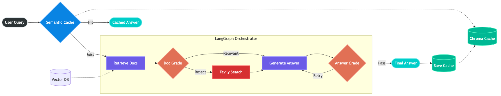
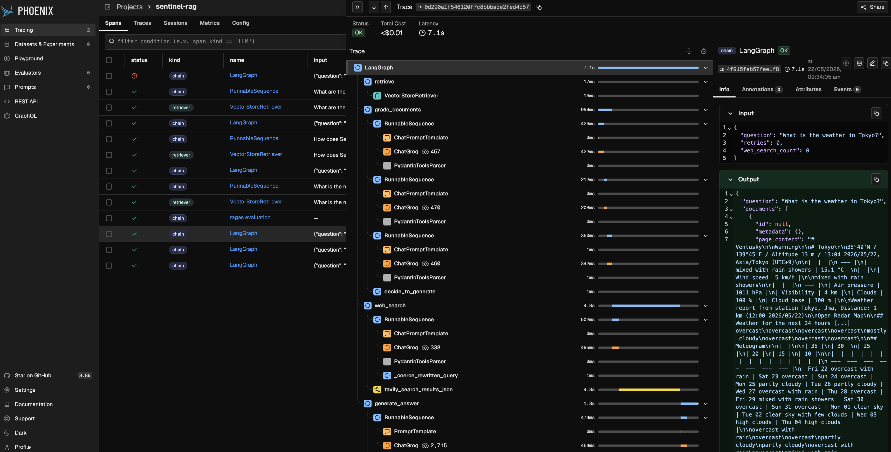

<div class="blog-manual-meta">Published by Ramu Nalla - May 23, 2026</div>

{width=80% style="margin: 20px auto; display: block;"}

---

Standard "Naive RAG" (Retrieval-Augmented Generation) is incredibly easy to prototype, but it is notoriously brittle in production. 

When I built my first vector-search application, it worked perfectly for questions where the exact answer lived neatly in a PDF. However, it quickly hit an enterprise wall. If the vector database returned irrelevant chunks, the LLM would blindly trust them and generate garbage. If a user asked an out-of-domain question, it would confidently hallucinate. Furthermore, running the entire retrieval and generation pipeline for every single user query was burning latency and API credits.

To deploy AI systems in the real world, they must be resilient, self-correcting, and cost-aware. We need to shift from passive pipelines to **Agentic Workflows**.

In this post, I will break down the architecture of **SentinelRAG**—a project where I replaced the linear RAG pipeline with a LangGraph state machine. By implementing self-reflection, Corrective RAG (CRAG) fallbacks, and an aggressive semantic caching layer, I successfully eliminated data-grounding hallucinations and slashed inference latency from over 2 seconds to just 10 milliseconds.

## 1. The Core Flaw: Why "Naive RAG" Fails

Think of a Naive RAG pipeline like a highly efficient but completely uncritical librarian. A user asks a question, the librarian runs to the Vector Database, grabs the top 3 documents based on mathematical cosine similarity, and hands them to the LLM to summarize. 

**The Flaw:** Cosine similarity is not semantic relevance. The word "Apple" (fruit) and "Apple" (company) occupy similar vector spaces in many embedding models. If the retrieved context is wrong, the LLM generates a hallucination. 

We need a system that pauses and asks: *"Does this document actually contain the answer?"* before generating text.

## 2. Self-RAG & CRAG Architectures

To fix this, I implemented two modern AI design patterns:

1. **Self-RAG (Self-Reflective RAG):** Using independent LLM "graders" to actively score the relevance of retrieved documents and the groundedness of the final answer.
2. **CRAG (Corrective RAG):** Implementing a dynamic fallback mechanism. If local vector data is insufficient, the system rewrites the query and searches the live internet.

### Architecting the "Agentic Brain"
I orchestrated this logic using **LangGraph**, treating the pipeline as a cyclical state machine rather than a linear script.

{width=80% style="margin: 20px auto; display: block;"}

Instead of blindly generating, the agent traverses specific decision nodes:

* **Node 1 (Document Grader):** I forced Meta's Llama-3-70B model to use Pydantic structured outputs to binary-score documents (`"yes"` or `"no"`). If a document scores `"no"`, it is physically deleted from the agent's context window.
* **Node 2 (The CRAG Router):** If all documents are rejected, the agent realizes it lacks local knowledge. It routes to a Query Rewriter, formulates a better search intent, and queries the Tavily Web Search API.
* **Node 3 (Hallucination Grader):** After generation, a final LLM evaluator checks the output against the retrieved facts. If it detects a hallucination, the agent loops back and retries the generation.

## 3. Semantic Caching

Agentic workflows are powerful, but they are incredibly expensive. Running a query through a retriever, three grading LLMs, and a web search takes time. 

If 1,000 employees ask the HR chatbot, *"What is the remote work policy?"*, you shouldn't trigger the agent 1,000 times. You should trigger it once. To solve this, I built an aggressive **Semantic Cache** using ChromaDB as an interceptor.

```python
# The Cache Interceptor Logic
results = cache_store.similarity_search_with_score(query, k=1)
doc, distance = results[0]

# Chroma uses L2 distance. < 0.20 equates to high cosine similarity
if distance < 0.20:
    return doc.metadata["answer"] # Cache Hit: Bypass LLM entirely
else:
    return route_to_langgraph_agent(query) # Cache Miss: Run full agent
```

### Telemetry: The 99% Latency Drop
I benchmarked the system using local CPU embeddings (BAAI/bge-small-en-v1.5) and the Groq API. The performance gains were massive.

By embedding the incoming user query and comparing its vector distance to previously answered queries, the system can instantly catch rephrased questions without making a single LLM call.

::: {.blog-content-table}

| Query Type | Route Taken | Latency | Outcome |
|:-----------|:------------|:-------:|:--------|
| "What is the primary purpose of Self-RAG?" | Full LangGraph Agent | 2.043s | Generated & Cached |
| "What is the primary purpose of Self-RAG?" | Cache Interceptor (Exact) | 0.010s | ~99.5% Faster |
| "What's the main goal of the Self-RAG framework?" | Cache Interceptor (Semantic) | 0.010s | ~99.5% Faster |

:::

Because vector embeddings capture intent, the cache successfully recognized that "primary purpose" and "main goal" meant the exact same thing, returning the answer in 10 milliseconds.

## 4. Observability

You cannot manage what you cannot measure. When building cyclical AI agents, standard console print statements become unreadable. I instrumented the entire pipeline with Arize Phoenix to visually trace the agent's decision tree.

{width=80% style="margin: 20px auto; display: block;"}

In the trace above, you can actively see the system's resilience. I asked an out-of-domain question ("What is the weather in Tokyo?"). The agent queried the local Vector DB, evaluated the chunks, and successfully rejected all of them. It then cleanly pivoted to the Web Search node, grabbed live data, and generated a grounded answer. No hallucinations.

## 5. Quantitative Evaluation (Ragas)

To definitively prove that this Agentic workflow outperforms Naive RAG, I ran the pipeline through the Ragas (RAG Assessment) framework.

I evaluated the system on a dataset mixing in-domain questions (vector retrieval) and out-of-domain questions (forcing web fallbacks).

::: {.blog-content-table .ragas-per-question}

| Question | Faithfulness (Groundedness) | Answer Relevancy |
|:---------|:--------------------------:|---------------:|
| What is the concept of Self-RAG? | 1.00 | 0.92 |
| How does Self-RAG handle hallucinations? | 1.00 | 0.97 |
| What is the weather in Tokyo? (Web Fallback) | 1.00 | 0.95 |
| **Overall Mean Score** | **1.00** | **0.954** |

:::

::: {.blog-content-table .ragas-summary}

| Metric | SentinelRAG Score | Impact / Meaning |
|:-------|:-----------------:|:-----------------|
| Faithfulness (Groundedness) | 1.00 (100%) | The Hallucination Grader successfully forced the model to only use retrieved/searched facts. Zero hallucinations detected. |
| Answer Relevancy | 0.954 (95.4%) | The CRAG web fallback ensured that even out-of-domain questions received highly accurate, useful answers. |

:::

## Conclusion

Building "AI Wrappers" is a thing of the past. To build resilient AI systems, we must treat LLMs not just as text generators, but as routing engines, evaluators, and judges.

By wrapping a standard Vector Database in a LangGraph state machine, enforcing Pydantic structured outputs, and intercepting queries with a Semantic Cache, SentinelRAG achieves the speed and reliability required for production deployment.

You can explore the full LangGraph node logic, the ChromaDB caching setup, and the evaluation scripts in the [sentinel-RAG repository on GitHub](https://github.com/RamuNalla/sentinel-RAG). Feel free to clone it, add your own API keys, and watch the agent think for itself!
