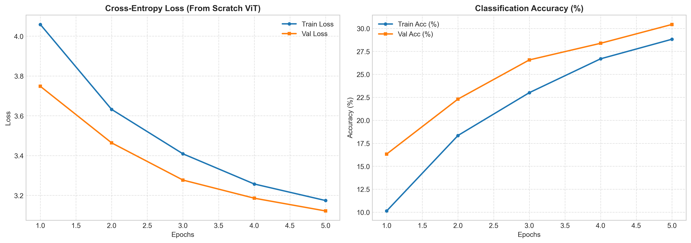

<div class="blog-manual-meta">Published by Ramu Nalla - October 3, 2026</div>

{width=80% style="margin: 20px auto; display: block;"}

---

For a decade, "computer vision" meant "convolutions". Local filters, weight sharing, pooling — the architecture itself told the model that nearby pixels matter more than distant ones.

Then the Vision Transformer (ViT) showed up and asked a blunt question: what if we throw all of that away and just treat an image like a sentence?

In this project, I built a ViT from scratch in PyTorch — no `timm`, no `nn.TransformerEncoder`, no pre-built attention layers. Every component (patch extraction, the `[CLS]` token, positional embeddings, multi-head self-attention, the encoder block) is written by hand so the mechanics are fully visible. I then trained it on CIFAR-100 and unit-tested every layer's tensor shapes.

## Why Build ViT From Scratch?

Using a library ViT teaches you how to call a library. Writing one teaches you:

- Where the image becomes a sequence — and what the sequence length actually is.
- Why a classification token exists at all.
- What tensor shapes flow through multi-head attention, and where the reshapes happen.
- Why ViTs are so hungry for data and augmentation compared to CNNs.

**The core trade-off:**

- CNNs have a built-in *inductive bias*: locality and translation equivariance.
- ViTs have almost none. They must *learn* spatial structure from data.
- On a small dataset with no pre-training, that freedom becomes a liability — which is exactly what makes CIFAR-100 an instructive testbed.

## The Architecture

The pipeline has four stages:

1. **Patchification:** split a $32 \times 32$ image into non-overlapping $4 \times 4$ patches, giving $(32/4)^2 = 64$ tokens.
2. **Tokenisation & positional embedding:** prepend a learnable `[CLS]` token and add learnable 1D positional encodings — 65 tokens in total.
3. **Transformer encoder:** a stack of Pre-Norm blocks, each with Multi-Head Self-Attention (MHSA) and an MLP with GELU.
4. **Classification head:** take the final `[CLS]` representation and map it to 100 class logits.

```
[Input Image: 3 x 32 x 32]
      │
      ▼ (Conv2d Patchify)
[Patches: 64 x D] ──> + [CLS Token & Positional Encodings (65 x D)]
      │
      ▼
[Transformer Encoder Block x Depth]  (Pre-Norm + MHSA + MLP)
      │
      ▼
[Extract [CLS] Token Representation]
      │
      ▼
[Linear Classifier Head] ──> [CIFAR-100 Logits]
```

The repository is split so each file maps to exactly one idea:

```text
src/
├── data/dataset.py          # CIFAR-100 loaders + augmentation
├── models/
│   ├── embeddings.py        # Patchification + [CLS] + PosEmbed
│   ├── attention.py         # Multi-Head Self-Attention
│   ├── mlp.py               # Feed-forward network
│   ├── block.py             # Pre-Norm encoder block
│   └── vit.py               # Full model assembly
├── engine/trainer.py        # Train / evaluate loops
└── train.py                 # Entry point (YAML config driven)
tests/test_shapes.py         # Pytest tensor-shape assertions
```

## Building It: The Key Components

### Patch Embedding — A Conv2d in Disguise

Cutting an image into patches, flattening each one and applying a shared linear projection is mathematically identical to a convolution whose kernel size equals its stride. So the whole step is one `nn.Conv2d`:

```python
class PatchEmbedding(nn.Module):
    def __init__(self, in_channels=3, patch_size=4, emb_dim=64, image_size=32):
        super().__init__()
        self.num_patches = (image_size // patch_size) ** 2
        self.projection = nn.Conv2d(
            in_channels, emb_dim,
            kernel_size=patch_size, stride=patch_size
        )

    def forward(self, x):                 # (B, 3, 32, 32)
        x = self.projection(x)            # (B, D, 8, 8)
        x = x.flatten(2)                  # (B, D, 64)
        return x.transpose(1, 2)          # (B, 64, D)
```

- Each of the 64 patches (48 raw values: $4 \times 4 \times 3$) is projected to a $D$-dimensional token.
- The "stride = kernel" trick means no patch overlaps and no pixel is seen twice.
- This is the *only* convolution in the whole model — and it is just a fast linear layer.

### `[CLS]` Token and Positional Embeddings

Self-attention is permutation-invariant: shuffle the patches and the output is just shuffled too. Two additions fix this and give us something to classify with:

```python
self.cls_token = nn.Parameter(torch.randn(1, 1, emb_dim))
self.pos_embed = nn.Parameter(torch.randn(1, num_patches + 1, emb_dim))
nn.init.trunc_normal_(self.cls_token, std=0.02)
nn.init.trunc_normal_(self.pos_embed, std=0.02)

def forward(self, x):
    B = x.shape[0]
    x = self.patch_embed(x)                          # (B, 64, D)
    cls = self.cls_token.expand(B, -1, -1)           # (B, 1, D)
    x = torch.cat((cls, x), dim=1)                   # (B, 65, D)
    return self.dropout(x + self.pos_embed)          # + learnable positions
```

- The `[CLS]` token is a learned vector that attends to every patch; by the last layer it acts as a summary of the whole image.
- The positional embeddings are *learned*, not sinusoidal — the model discovers for itself that patch 9 sits below patch 1.
- Small-std truncated-normal init keeps early training stable.

### Multi-Head Self-Attention

```python
class MultiHeadAttention(nn.Module):
    def __init__(self, emb_dim=64, num_heads=8, dropout=0.1):
        super().__init__()
        self.head_dim = emb_dim // num_heads
        self.qkv_projection = nn.Linear(emb_dim, emb_dim * 3)
        self.out_projection = nn.Linear(emb_dim, emb_dim)

    def forward(self, x):
        B, N, D = x.shape
        q, k, v = self.qkv_projection(x).chunk(3, dim=-1)

        # (B, N, D) -> (B, heads, N, head_dim)
        q = q.view(B, N, self.num_heads, self.head_dim).transpose(1, 2)
        k = k.view(B, N, self.num_heads, self.head_dim).transpose(1, 2)
        v = v.view(B, N, self.num_heads, self.head_dim).transpose(1, 2)

        out = F.scaled_dot_product_attention(
            q, k, v, dropout_p=self.dropout if self.training else 0.0
        )
        out = out.transpose(1, 2).contiguous().view(B, N, D)
        return self.out_projection(out)
```

- Q, K and V come from a **single fused linear layer** and are split with `.chunk` — one matmul instead of three.
- `F.scaled_dot_product_attention` computes $\text{softmax}\!\left(\frac{QK^T}{\sqrt{d_k}}\right)V$ using PyTorch's fused kernels, so we get FlashAttention-style efficiency where available.
- The `assert emb_dim % num_heads == 0` guard catches bad configs early.

### Pre-Norm Encoder Block

```python
class TransformerEncoderBlock(nn.Module):
    def forward(self, x):
        x = x + self.attn(self.norm1(x))   # Pre-norm attention + residual
        x = x + self.mlp(self.norm2(x))    # Pre-norm MLP + residual
        return x
```

- **Pre-Norm** (LayerNorm *before* each sub-layer) keeps the residual path clean, which makes gradients flow far more stably than the original Post-Norm — important when training from scratch.
- The MLP expands by 4x, applies GELU, and projects back: $D \rightarrow 4D \rightarrow D$.

### Assembling the Full Model

```python
def forward(self, x):
    x = self.embeddings(x)             # (B, 65, D)
    for block in self.encoder_blocks:
        x = block(x)
    x = self.norm(x)
    return self.head(x[:, 0])          # [CLS] token -> (B, 100)
```

## Verifying Every Tensor Shape

Transformer bugs are usually silent shape bugs — a transposed axis still runs, it just trains badly. So `tests/test_shapes.py` asserts the shape at every stage:

| Component | Input | Output |
|:----------|:-----:|:------:|
| `PatchEmbedding` | (B, 3, 32, 32) | (B, 64, D) |
| `ViTEmbeddings` | (B, 3, 32, 32) | (B, 65, D) |
| `MultiHeadAttention` | (B, 65, D) | (B, 65, D) |
| `TransformerEncoderBlock` | (B, 65, D) | (B, 65, D) |
| `VisionTransformer` | (B, 3, 32, 32) | (B, 100) |

```bash
pytest tests/
```

## The Experiment: Training on CIFAR-100

**Model configuration** (driven by `configs/train_cifar100.yaml`):

- Patch size 4, embedding dim 128, depth 6, 8 heads, MLP expansion 4x, dropout 0.1
- Roughly **1.2M parameters** — tiny by ViT standards (ViT-Base is ~86M).

**Training recipe:**

- Optimizer: **AdamW**, lr $3 \times 10^{-4}$, weight decay 0.05
- Schedule: cosine annealing
- Loss: cross-entropy with **label smoothing 0.1**
- Gradient clipping at norm 1.0 to stabilise early steps
- Batch size 128, **5 epochs**

**Data augmentation** (essential without convolutional priors):

- Random crop with 4px reflect padding
- Random horizontal flip
- Per-channel CIFAR-100 mean/std normalisation

### Results

::: {.blog-content-table}
| Epoch | Train Loss | Train Acc | Val Loss | Val Acc |
|:-----:|:----------:|:---------:|:--------:|:-------:|
| 1 | 4.059 | 10.14% | 3.748 | 16.33% |
| 2 | 3.632 | 18.35% | 3.464 | 22.31% |
| 3 | 3.409 | 23.01% | 3.277 | 26.57% |
| 4 | 3.257 | 26.69% | 3.186 | 28.38% |
| 5 | 3.174 | 28.82% | 3.122 | **30.43%** |
:::

{width=90% style="margin: 20px auto; display: block;"}

**What the curves show:**

- **Both curves are still improving at epoch 5.** Loss is falling and accuracy rising with no sign of a plateau — this is a short run, and 30.43% is a floor, not a ceiling.
- **Validation beats training.** That looks odd but is expected here: training metrics are measured *with* dropout, random crops/flips and label smoothing active, while validation uses clean images. Label smoothing also inflates the reported loss floor.
- **No overfitting yet.** The classic ViT failure mode on small data appears later, once the model has memorised the training set; with only 5 epochs we are still in the underfitting regime.

For context, random guessing on 100 classes is 1% — so the model is roughly 30x better than chance after about five minutes of training on a small network.

## Why ViTs Struggle on Small Datasets

Without massive pre-training (ImageNet-21k, JFT-300M), a ViT has to discover things a CNN gets for free:

- That neighbouring pixels are related (locality).
- That a cat in the corner is still a cat (translation equivariance).

That is why the recipe leans so heavily on regularisation: augmentation, weight decay, label smoothing, dropout and gradient clipping. Longer training, stronger augmentation (RandAugment, Mixup, CutMix) or a smaller patch size would all be natural next steps to push accuracy higher.

## Running It

```bash
git clone https://github.com/RamuNalla/vit-from-scratch.git
cd vit-from-scratch
python -m venv venv && source venv/bin/activate
pip install torch torchvision tqdm matplotlib pyyaml pytest

# Train (CIFAR-100 downloads automatically on first run)
python -m src.train --config configs/train_cifar100.yaml

# Verify tensor shapes layer by layer
pytest tests/
```

- The best checkpoint is saved to `best_vit_cifar100.pth`.
- Per-epoch history is written to `docs/assets/training_history.json`, which the logger turns into the plots above.
- Changing depth, heads, patch size or learning rate is a one-line YAML edit.

## Conclusion

A Vision Transformer is not magic — it is a `Conv2d` to make tokens, a learned `[CLS]` token and position vector, and a stack of attention-plus-MLP blocks that any NLP engineer would recognise. Writing each piece by hand makes that concrete: the whole model is about 1.2M parameters spread over five short files.

The trade-off is just as clear. With no pre-training and no convolutional prior, the model reaches 30.43% validation accuracy on CIFAR-100 in five epochs and is still climbing — a healthy start, and a reminder of why ViTs only truly shine with scale and data.

You can explore the full implementation, config and test suite in the [vit-from-scratch repository on GitHub](https://github.com/RamuNalla/vit-from-scratch).
